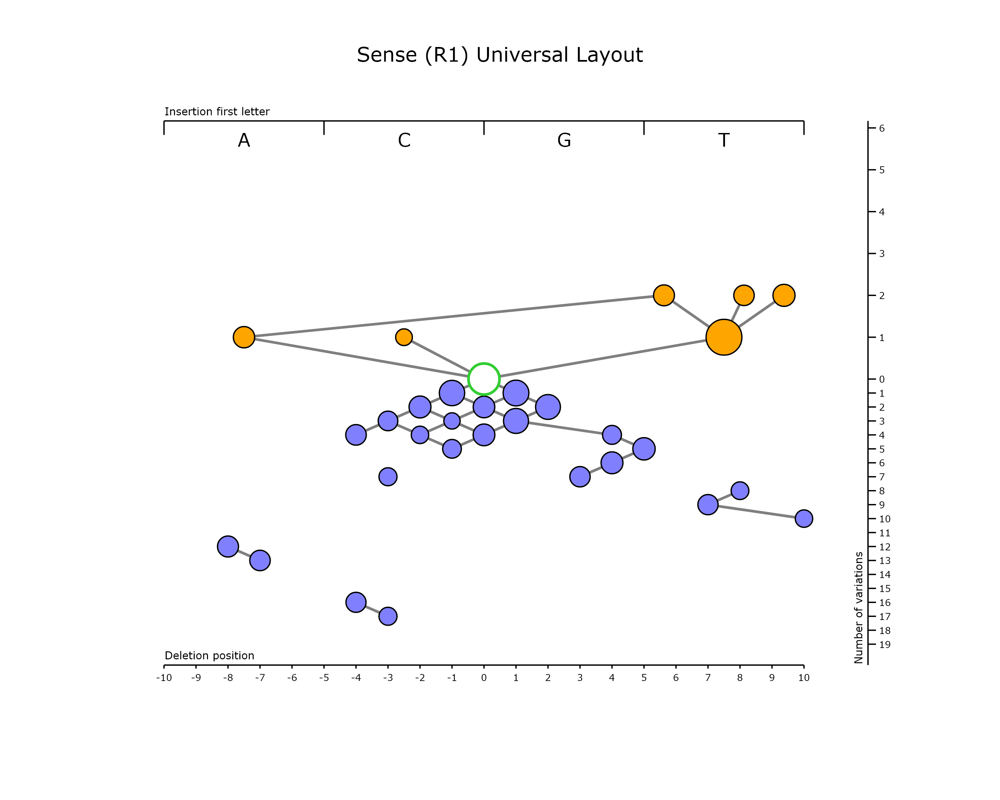
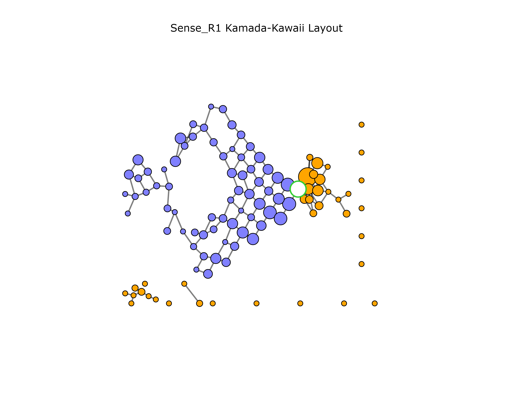
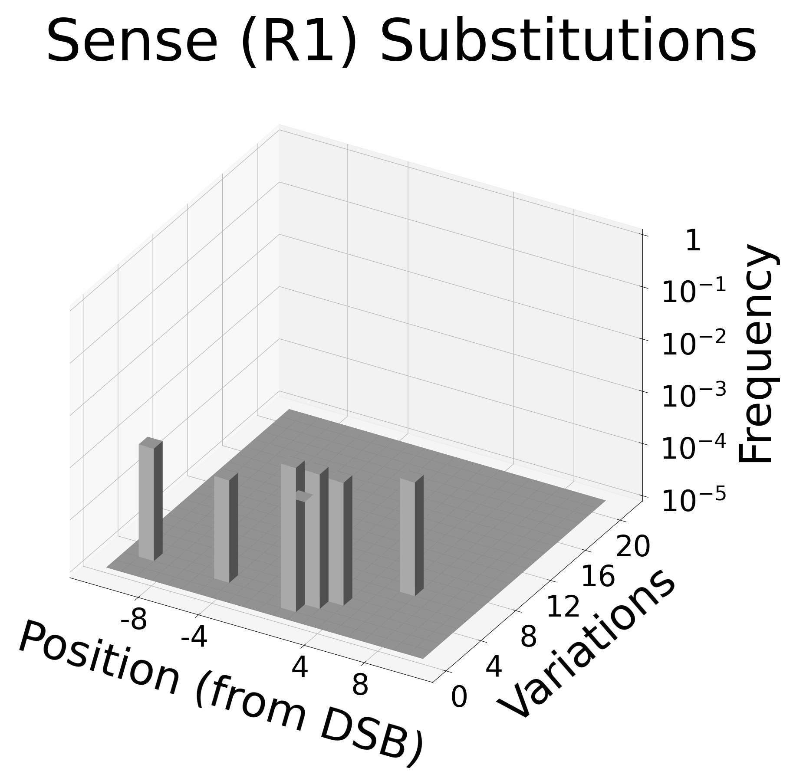
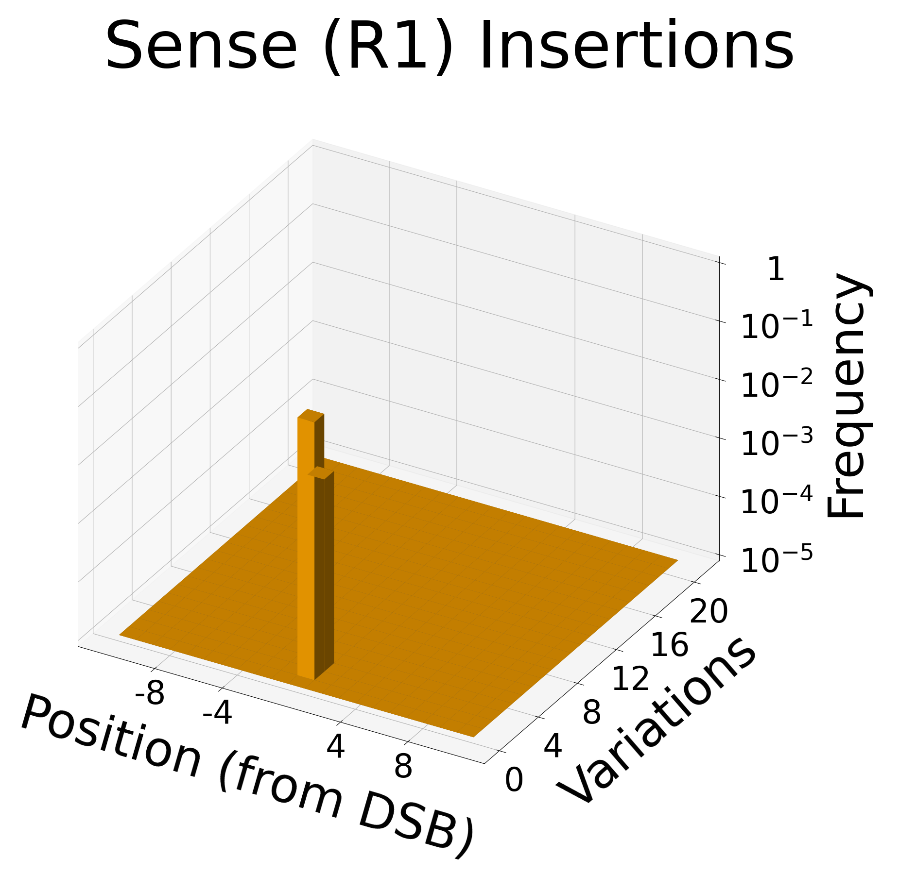
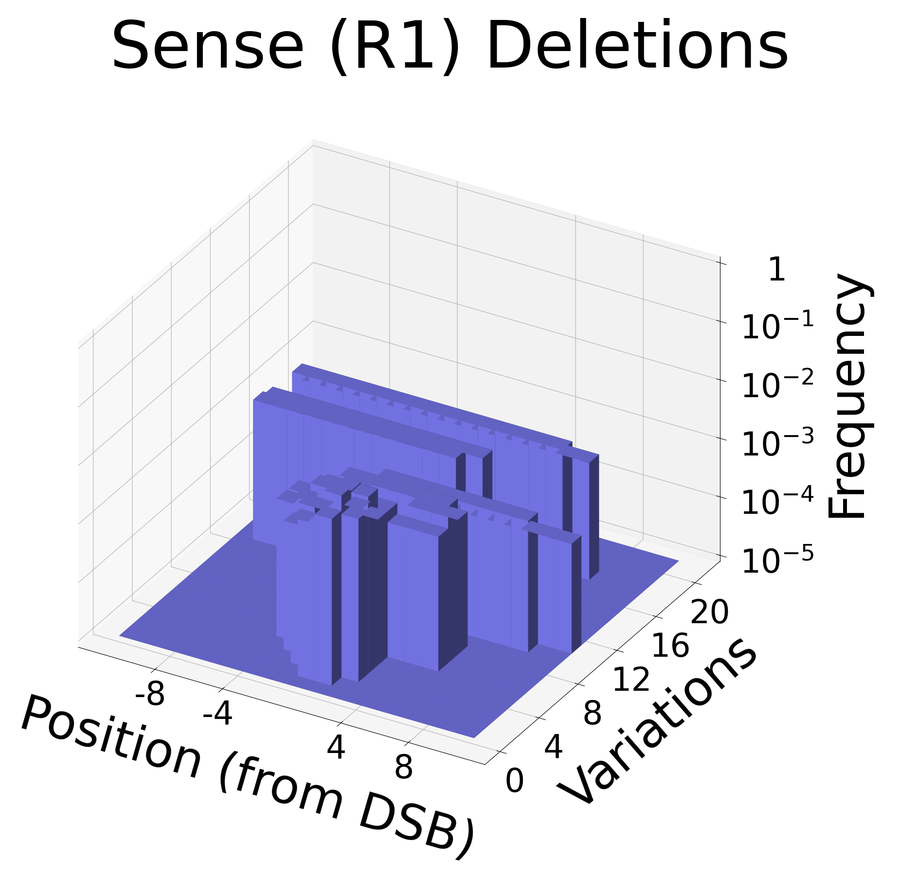

# DSBplot

## Introduction

This `DSBplot` software is intended to allow processing and visualizing high-throughput sequencing data obtained for the purpose of studying double-strand break (DSB) repair due to the nonhomologous end-joining (NHEJ) repair mechanism. Basically, this means that we study the indels (insertions and deletions of nucleotides) that occur near the DSB site. The accompanying article can be found at LINK. This protocol was originally used in the study Jeon et al. ([link](https://doi.org/10.1101/2022.11.01.514688)) for studying DSB repair in human cells. That publication contains several examples of the graphs in the supplementary figures, as well as a discussion of insights gained from the resulting figures.

The overall functionality of the package is to:
  1. Process DNA-seq short reads that have been obtained from DSB repair experiments.
  2. Quantify the variations (insertions, deletions, and substitutions) near the DSB site using sequence alignment.
  3. Visualize the resulting variations using two types of figures: *variation-distance graphs* and *variation-position histograms*.

The expected inputs are DNA-seq short read libraries that have been obtained with *targeted amplicon sequencing*, meaning that sequencing primers are placed surround the DSB site to amplify a specific sequence around the DSB repair site. For a more detailed description of the expected input and how to the run the software, see section [Commands](#commands) and the publication associated with this software (LINK).

## Citation

If you use this software, please use the citation:

XXX

or in BibTex format:

XXX

## Installation

To install the package, use the command

```
pip install DSBplot
```

The tested Python version is 3.11.0. The required dependencies are:

* kaleido (if using window the version *must* be "0.1.0.post1", please see [here](https://github.com/plotly/Kaleido/issues/134)).
* Levenshtein (tested version 0.21.0)
* matplotlib (tested version 3.7.1)
* networkx (tested version 3.1)
* numpy (tested version 1.24.3)
* pandas (tested version 2.0.1)
* Pillow (tested version 9.5.0)
* plotly (tested version 5.14.1)
* scikit-learn (tested version 1.2.2)

To install these dependencies use the command

```
pip install kaleido Levenshtein matplotlib networkx numpy pandas Pillow plotly scikit-learn
```

For a full list of the libaries used in testing, please see `requirements.txt`.

Bowtie 2 (tested version 2.5.0) should be installed and available on the system path. Particularly, the executables `bowtie2-build-s` and `bowtie2-align-s` should be available as commands (internally, we use the Python function `os.system()` to run Bowtie 2).

## Commands

This package is based on the following four commands:

* `DSBplot-process`: takes as input the trimmed FASTQ reads files and a FASTA file containing the reference sequence, and creates the intermediate tables of DNA sequences needed for plotting the graphs and histograms. The input files should represent replicate experiments (e.g., biological replicates).
* `DSBplot-graph`: takes as input a collection of the output directories of either `DSBplot-process`, lays out sequences in all inputs, and plots a separate graph for each input. FIXME, MOVE FOLLOWING SENTENCE TO LATER. Each argument may either be a single directory, in which case the corresponding plot is an *individual* graph, of the argument may be two directories separated by `::`, in which case the corresponding plot is a *comparison* graph.
* `DSBplot-histogram`: takes as input an output directories of `process` and plots a histogram showing the type and position of variations (insertions, deletion, or substitutions) in the sequences.

Once DSBplot is installed, these commands should be available from the command line. More information about each command is given in the following subsections. We use the notation `NAME` to refer to arguments (value of a command-line parameter set by the user) and the notation `--name` to refer to the parameter itself. The notation `file_name.ext` is used to refer to file names.

### `DSBplot-process`

The `DSBplot-process` command perform alignment and processing of the preprocessed FASTQ data.

#### Input

We expect that the input FASTQ files to `process` have already been trimmed and quality filtered by the user. No further trimming and quality filtering is done by this pipeline. The region of DNA represented in these reads must exactly math the region of DNA represented by the reference sequence (aka amplicon sequence). This mean that if a given read represents a perfectly repaired DNA molecule, it should be identical to the reference sequence (assuming no sequencing substitution errors). If multiple input FASTQ files are given, it is assumed that they are replicates of the same treatment condition. They are all processed identically and then combined into a single file (see [processing stages](#prepcocessing-stages) below).

#### Alignment substitutions

The processing pipeline produces two different versions of most files: one *without* substitutions (suffix "withoutSubst") and another *with* substitutions (suffix "withSubst"). The processing for files that ignore substitutions contains an extra step that replaces alignment substitutions (aka mismatches) with perfect matches with the reference sequence. Substitutions in our previous analyses because we noticed a similar distribution of substitutions occurring in both the postive treatment group (where DNA double-strand breaks were induced) and the control group (where no DSBs were induced). This suggested that the majority of substitutions were likely caused by DNA damage during library preparation or sequencing errors, rather than representing variations due to the DNA repair process. In the command `DSBplot-graph`, the `--sub` parameter controls whether to use the output with or without substitutions. The `DSBplot-histogram` command only uses the output with substitutions, since it is used to examine the distribution of substitutions.

#### Processing stages

This `DSBplot-process` command is broken in separate stages so that each stage can be run separately. However, the stages must be run in the correct order indicated by their prefixes. When running the stages separately, the value of the `OUTPUT` directory must the same value on each separate invocation. Two different experiments should not be given the same `OUTPUT` directory or the data from the second will overwrite the first. The following describes each stage in more detail.

1. **0_align**: Align FASTQ reads against FASTA reference sequence. This stage requires multiple input FASTQ files representing independent replicates of the same treatment condition. The base file names of the libraries, after removing the file extension, must all be distinct and be given in alphabetical order. The alignment is done independently for each of the input FASTQs. The output of this step is a set of [SAM](https://samtools.github.io/hts-specs/SAMv1.pdf) files. Please ensure that [Bowtie 2](https://bowtie-bio.sourceforge.net/bowtie2/index.shtml) is installed and that the commands `bowtie2-build-s` and `bowtie2-align-s` are available on the system path for use by the Python function `os.system()`. The output files from this stage are:

    * `bowtie2/*`: The Bowtie 2 index files built with `bowtie2-build-s`.
    * `<lib>.sam`: The SAM file output from the alignment by `bowtie2-align-s`, where `<lib>` is a placeholder for the base file name of the library without the extension. There will be as many output SAM files as there are input libraries.

2. **1_filter**: Filter each SAM file independently using heuristics to discard alignments that may not represent NHEJ repair. The filtering process involves the following steps:

    1. Discard alignments that have an invalid SAM FLAG field. The only allowed flags values are 0 (for a successful forward alignment) or 16 (for a successful reverse-complement alignment, if `RC` = 1).
    2. Discard alignments where the read sequence has length less than `MIN_LEN`.
    3. Discard alignments where the left-most (5'-most) position of the read does not align with the left-most position of the reference sequence (that is the SAM POS field must be 1).
    4. If the indel positions of the alignment are not touching the DSB position or not consecutive, try to shift them towards the DSB position in a way that does not increase the number of substitutions (mismatches). If such a modification of the alignment cannot be found, discard the alignment. These criteria may be modified with `--touch`, `--consec`, and `--realign`.
    5. Discard alignments whose number of substitutions is more than `MAX_SUB`.

   If multiple reads have exactly the same nucleotide sequence but had different alignments with the reference, they will be forced to have the same alignment as the first such read encountered. The left-most (5'-most) position on the read must align with the left-most position on the reference, but the same is not true for the right-most (3'-most) positions. This is because it is possible for reads to be too small and only capture the 5' primer but not the 3' primer. However, the read must have a length of at least `DSB + 1` or `MIN_LENGTH`, whichever is larger. The output will be in the following files.

     * `filter_accepted.csv`: sequences that passed the filter (`seq` column). Additional columns are `debug` (reason for accepting), `sub` (number of substitutions), `cigar` (realigned CIGAR string), `cigar_old` (original CIGAR string), `freq_mean` (mean frequency of sequence over all repeats), `freq_<lib>` (separate frequency column for each replicate library, `<lib>`), `count_<lib>` (separate count column for each replicate library, `<lib>`), `rank_<lib>` (separate rank column for each replicate library, `<lib>`, from 1 (most frequent) to least frequent; 999999999 indicates that the sequence was not present in the library).
     * `filter_rejected.csv`: sequences that failed the filter (`seq` column). Additional columns are `debug` (reason for rejecting), `cigar_old` (original CIGAR string), `unaligned` (was the read unaligned in the SAM file; SAM FLAG 4), `freq_mean` (mean frequency of sequence over all repeats), `freq_<lib>` (separate frequency column for each replicate library, `<lib>`), `count_<lib>` (separate count column for each replicate library, `<lib>`), `rank_<lib>` (separate rank column for each replicate library, `<lib>`, from 1 (most frequent) to least frequent; 999999999 indicates that the sequence was not present in the library).
     * `filter_debug.csv`: summary table showing the number of reads accept/rejected and for what reason, in each replicate library.
     * `filter_args.json`: JSON file showing the arguments passed to the `filter.py` script.

3. **2_window**: For each unique alignment in the output table of stage **1_filter**, extract the portion of the read that aligns to the positions `DSB - WINDOW + 1` to `DSB + WINDOW` on the reference sequence. If different reads become identical after extracting their windows, their read counts will be summed. To ensure that variations near the DSB do not spill outside the window, *anchors* must be present on either side of the extracted windows. Anchors are the parts of the read that align to the `ANCHOR` nucleotides on the left (5') and right (3') of the window on the reference. These are the nucleotides `DSB - WINDOW - ANCHOR + 1` to `DSB - WINDOW` (left anchor) and `DSB + WINDOW + 1` to `DSB + WINDOW + ANCHOR` (right anchor) on the reference sequences. Each anchor must have at most `ANCHOR_VAR[0]` mismatches and `ANCHOR_VAR[1]` indels, or it is discarded. The anchor check may be omitted by setting `ANCHOR` = 0. The output are the following tables in TSV format.

    * `window_withoutSubst.tsv`: windows with the substitutions removed by replacing them with perfect matches to the reference sequence. See [here](#substitutions-in-bowtie-2) for the justification of removing substitutions.
    * `window_withoutSubst_args.json`: JSON file showing the arguments passed to the `get_window.py` script for the output without substitutions.
    * `window_withSubst.tsv`: version of the output with substitutions retained.
    * `window_withSubst_args.json`: JSON file showing the arguments passed to the `get_window.py` script for the output with substitutions.
   
   The columns in these files are `ref_align` (the alignment string corresponding to the reference sequence), `read_align` (the alignment string corresponding to the read sequence), `freq_mean` (mean frequency of sequence over all repeats), `freq_<lib>` (separate frequency column for each replicate library, `<lib>`), `count_<lib>` (separate count column for each replicate library, `<lib>`).

5. **3_variation**: Separate each alignment into its consistutent variations. For example, the alignment `AC-CGT` (reference), `-CGCTT` (read) would be split into 3 variations: deletion at position 1 (`A` ⇒ `-`), insertion at position 2 (`-` ⇒ `G`), and substitution at position 3 (`G` ⇒ `T`). The keys identifying each unique variation are: the total number of variations on the parent alignment, the position of the variation, and the type of variation. In the previous example this would be: (3, 1, 'del'), (3, 2, 'ins'), and (3, 3, 'sub'). The output is located in the following files.

    * `variation_withoutSubst.tsv`: variation TSV table made from alignments without substititions.
    * `variation_withSubst.tsv`: variation TSV table made from alignments with substititions.
    * `variation_withoutSubst_args.json`: JSON file showing the arguments passed to the `get_variation.py` script for the output without substitutions.
    * `variation_withSubst_args.json`: JSON file showing the arguments passed to the `get_variation.py` script for the output with substitutions.
  
   The columns in these files are `freq_mean` (mean frequency of variation over all repeats), `freq_<lib>` (separate frequency column for each replicate library, `<lib>`), `count_<lib>` (separate count column for each replicate library, `<lib>`), `num_var` (number of variations on the parent alignment), `var_pos` (position of the variation on the reference sequence), `var_type` (type of variation: 'ins', 'del', or 'sub'), `var_letter` (pair of letters showing the corresponding nucleotide or '-' on the reference and read alignment string, respectively). The frequencies and counts are computed by summing the frequencies and counts of all alignments that have the identical variation (i.e., meaning a variation with identical `var_pos`, `num_var`, and `var_type`).

For more information about the parameters, please use the command `DSBplot-process --help`.

# CONTINUE FIXING HERE

### `DSBplot-comparison`

This command creates data needed to compare two different sequencing libraries. Specifically, it takes as input two directories that were created using the `DSBplot-process` command, and will output a third directory that contains equivalent data for creating comparison graphs of the two samples. For meaningful comparisons, it is important that the reference sequences (after restricting to the specified window) are identical between the two libraries. The output data will contain the same columns as that output from `DSBplot-process`, but will have two additional columns (with suffixes `_1` and `_2`) for the frequencies of the two different samples being compared. The original frequency column, with no suffix, will contain the maximum of these two frequencies. The output will be in the subdirectories `3_window` and `4_graph`. Note that the histogram data is not recomputed because the comparison data should not be used to create histograms. For more details about the parameters, please use the command `DSBplot-comparison --help`.

### `DSBplot-graph`

This command performs the vertex lay out and final plotting of the variation-distance graphs. Multiple inputs may be specified to lay out the vertices jointly, as long as their windowed reference sequences are identical. See the [Graphs](#graphs) section for a description of the meaning of different visual properties of the graph (e.g., edges, vertex sizes, colors, etc.). For more details about the parameters, please use the command `DSBplot-graph --help`.

### `DSBplot-histogram`

This commands plots the 3D histograms, which summarize the distribution of the variations in the windows around the DSB site. Each histogram shows a single type of variation (insertion, deletion, or substitution), which is determined by the `--var_type` parameter. The axes are described in the following.

* The position of each variation is shown on the $x$-axis of the graphs. The position can be measured in two ways: (1) relative to the position of the DSB, or (2) relative to the 5'-end of the window. Which of these two options is used depends on the value of the `--label_type` parameter. For deletions and substitutions, the position of the variation is unambiguous and corresponds to a specific position on the reference sequence. However, for insertions, the position is assigned to the left (5') position of the two consecutive positions around the insertion.
* The $y$-axis indicates the total number of indels on the sequence that the variation originated from.
* The $z$-axis indicates the total frequency of the variations with the given $x$- and $y$-coordinates.

To understand how the frequencies are calculated, consider the following example: Suppose an alignment in the data had one insertion at position 5, two deletions at positions 6 and 7, and an overall frequency of 0.1. Let's assume that the DSB is between positions 5 and 6, and that we are using relative labeling on the $x$-axis. In the insertion histogram, the alignment would contribute +0.1 to the z-value of the bar at the $x$-$y$-coordinate (-1, 3).  In the deletion histogram, the alignment would contribute +0.1 to the z-value of the bars at the $x$-$y$-coordinates (1, 3) and (2, 3). If we used absolute labeling, then the respective $x$-$y$-coordinates would be (5, 3), (6, 3), and (7, 3), since the positions are now labeled according to their absolute positions on the reference sequence.

For more details about the parameters, please use the command `DSBplot-histogram --help`.

## Graphs

In this section, we will explain the visual elements of the output graphs generated by the `graph.py` command. Please note that we use the terms "sequence" and "vertex" interchangeably, as there is a one-to-one correspondence between the windowed sequences produced by the [`DSBplot-process`](#dsbplot-process) command and the vertices of the graph.

### Layouts

Different *layouts*, specified with the `--layout` parameter, are used to position the vertices. We describe a subset of them in the following.

* Kamada-Kawaii: The Kamada-Kawaii algorithm is a physical simulation algorithm used for laying out graphs (Kamada and Kawai, 1989). In this algorithm, the graph is represented as a spring system where each pair of vertices is connected by a spring whose resting length is proportional to the shortest-path distance between the vertices. The algorithm works by finding the optimal positions of the vertices that minimize the energy of the system. The result is a layout that is both aesthetically pleasing and reveals the graph structure, such as clusters of vertices that are close together. The [NetworkX](#https://networkx.org/) Python package (Hagberg, 2008) implements this algorithm, and as of this writing, it initializes the vertices in a circle. Note that the shortest-path distance between two vertices is at least as large as the Levenshtein distance between them, but it doesn't have to be equal.
* Universal layout: We refer to this layout as the "Universal" layout because it assigns a predefined position to every admissable insertion and deletion, regardless of the subset of insertions and deletions present in the dataset. In contrast to the Kamada-Kawai algorithm, which positions vertices in a data-dependent manner, this layout algorithm is less flexible but highly interpretable and reproducible. This layout also only applies to data *without* substitutions (set with `--subst_type withoutSubst`), and does not allow sequences with mixed insertions/deletions (it currently fails if such sequences are encountered). Therefore, the admissable vertices always have either a single run of deletions touching the DSB site or a single run of insertions exactly at the DSB site. The universal layout places the reference vertex at the center of the figure, with insertion vertices above and deletion vertices below. For both insertion and deletion vertices, the $y$-coordinate is determined by the Levenshtein distance between the vertex's sequence and the reference sequence, which is simply the number of nucleotides inserted or deleted in the vertex's sequence. If a vertex's Levenshtein distance is $d$, then deletion vertices are placed $d * \alpha$ units below the reference, while insertion vertices are placed $d * \beta$ units above, where $\alpha, \beta$ are positive scaling factors determined by the parameters `--universal_layout_y_scale_insertion` and `--universal_layout_y_scale_deletion`. The $x$-coordinates of vertices are determined using different rules for insertions and deletions. Insertion vertices are ordered from left to right by alphabetical order, while deletion vertices are ordered from left to right based on the positions of the deleted nucleotides with respect to the DSB site. Figure 1 provides a key to the vertex placement in the universal layout. Note that there are several parameters to adjust the visuals of the Universal layout. Please see the parameters prefixed with `--universal_layout`. 
* Radial: This layout arranges the vertices in concentric circles around the reference sequence. The reference vertex is positioned at the center of the figure, while the insertion and deletion vertices are placed above and below the reference, respectively. The Levenshtein distance between a vertex and the reference determines its physical distance from the reference vertex. For instance, vertices with a Levenshtein distance of 1 are placed in the first concentric circle around the reference, and those with a Levenshtein distance of 2 are placed in the second circle, and so on. In each circle, insertion vertices are arranged in a clockwise direction based on their frequency, with the most frequent vertex at the top, while deletion vertices are arranged in a counterclockwise direction, also based on their frequency, with the most frequent vertex at the bottom. To ensure that the vertices do not overlap and edges are not collinear, heuristics are used to perturb the vertices slightly.


*Figure 1: Universal layout vertex placement key.*

### Graph aesthetics

In this section, we describe the visual features of the graphs. Not all parameters are described here; for a full description please use `DSBplot-graph --help`.

* Vertices:
  * Size: For an individual graph, the vertex radius is a function of the log-frequency. This is controlled by the parameters `--node_freq_range` and `--node_px_range`. Vertices with frequencies $\leq$ `NODE_FREQ_RANGE[0]` get `NODE_PX_RANGE[0]` and frequencies $\geq$ `NODE_FREQ_RANGE[1]` get `NODE_PX_RANGE[1]`. Frequencies in between get a radius that varies linearly with the log-frequency.
  * Outline: The outline color is intended to differentiate the reference sequence vertex from the other vertices. The colors are determined by the `--node_reference_outline_color` and `--node_outline_color` parameters.
  * Color: There are several ways the vertex color is determined:
    * Variation type: This mode is only for individual graphs. We give vertices a color depending on the type of variations present in their alignment: insertions only, deletions only, substitutions only, mixed (which is a combinations of insertions, deletions, and substitution), and none (which represents the reference sequence). These colors can be defined by using the `--var_type_colors` parameter.
    * Frequency ratio (continuous): This mode is only used for comparison graphs, and can be activated by setting the parameter `--node_comparison_color_type continuous`. In this mode, a color gradient is used for each vertex to indicate the frequency ratio of the vertex between the two experiments being compared. The ratio is calculated by putting the vertex's frequency in the first sample in the numerator and the vertex's frequency in the second sample in the denominator (the order is determined during processing). The colors at the two ends of the gradient are specified by the `--node_comparison_colors` parameter, while the colors in between are smoothly interpolated based on the frequency ratio. The range of ratios at the two ends of the gradient is determined by the `--node_freq_ratio_range` parameter.
    * Frequency ratio (discrete): This mode is only used for comparison graphs, and can be activated by setting the parameter `--node_comparison_color_type discrete`. In this mode, three colors are used to indicate the frequency ratio of the vertex between the two experiments being compared. If the frequency ratio is less than `NODE_FREQ_RATIO_RANGE[0]`, the color `NODE_COMPARISON_COLORS[1]` is displayed (meaning higher in sample 2). If the frequency ratio is greater than `NODE_FREQ_RATIO_RANGE[1]`, the color `NODE_FREQ_RATIO_RANGE[1]` is displayed (meaning higher in sample 1). If the frequency ratio is between `NODE_FREQ_RATIO_RANGE[0]` and `NODE_FREQ_RATIO_RANGE[1]` (inclusive), the vertex is colored white.
* Edges: All edges in the graph indicate a 1-nucleotide variation (insertion, deletion, or substitution) between the two vertices that are connected. The display of edges and which types of edges to show can be controlled by using the `--edge_show` and `--edge_types` parameters.
* Legends: The legends describe the vertex size, vertex outline, vertex color, and the edges. These can be all drawn by using the `--legend` parameter. The legends will be drawn in the right margin of the figure. To ensure enough room, use the `--margin_top_px`, `--margin_bottom_px`, `--margin_left_px`, and `--margin_right_px` parameters. The different legends are laid out vertically. To control the spacing between them use the `--legend_spacing_px` parameter.
* Title: A title can be optionally added to the top margin of the figure using the `--title` parameter.
* Universal layout axes: To illustrate the vertex placement for the universal layout, axes can be drawn on the figure. Using the `--universal_layout_x_axis_deletion_y_pos` parameter, a horizontal axis can be drawn on the deletion side (below the reference sequence), which, for each deletion vertex, shows the approximate position of the range of deleted nucleotides (see [Figure 1](#graphs)). Using the `--universal_layout_x_axis_insertion_y_pos` parameter, a horizontal axis can be drawn on the insertion side (above the reference sequence) to show the alphabetical order of the nucleotides. Using the `--universal_layout_y_axis_x_pos` parameter, a vertical axis can be drawn to show the Levenshtein distance of vertices from the reference vertex. There are several other parameters to control various aspects of the axes: `--universal_layout_x_axis_deletion_label_type`, `--universal_layout_y_axis_y_range`, `--universal_layout_x_axis_x_range`, `--universal_layout_y_axis_deletion_max_tick`, and `--universal_layout_y_axis_insertion_max_tick`. The following are used to scale the axes by different amount, mostly for the purpose of aesthetics: `--universal_layout_x_scale_insertion`, `--universal_layout_y_scale_insertion`, `--universal_layout_x_scale_deletion`, and `--universal_layout_y_scale_deletion`. To help positioning the axes, a message is printed to the console showing the range of $x$- and $y$-coordinates for each figure, when `DSBplot-graph`.
* Graph statistics: The `--stats` parameter can be used to display summary statistics of the graph in the left margin of the figure. If the graph has more than one connected component, the component containing the reference sequence is the only one used since the pairwise distance between vertices is not well-defined otherwise. To ensure that the left margin has enough space to display the summary statistics, the `--margin_left_px` parameter can be used.

## Demonstration

To begin this demonstration set the terminal working directory to the `demo_short` directory. The full sequence of commands described here are also included in the `run.ps1` script, which should run in less than a minute on a personal computer. Several example input files are available in the `input` directory:

* `data_demo/fastq/Sense_R1_1.fa`, `data_demo/fastq/Sense_R1_2.fa`, `data_demo/fastq/Sense_R1_3.fa`, `data_demo/fastq/Sense_R1_4.fa`: High-throughput sequencing reads in FASTQ format for four biological repeats of the Sense experiment (R1 indicates that the forward strand was sequenced).
* `input/ref_seq/2DSB_Sense_R1.fastq`: Reference sequence FASTA file for the Sense (R1) reads.

The FASTQ files have already been trimmed so that they should correspond to the reference sequence. Note that this is demonstration data that has been generated by taking a small subset of an actual dataset.

We will run commands so that the output data is written to the `output/Sense_R1` directory. To run all processing stages use the command:
```
DSBplot-process --input data/input/fastq/Sense_R1_1.fq data/input/fastq/Sense_R1_2.fq data/input/fastq/Sense_R1_3.fq data/input/fastq/Sense_R1_4.fq --ref_seq_file data/input/ref_seq/2DSB_Sense_R1.fa --dsb_pos 67 --output data/output/Sense_R1 --label "Sense" --total_reads 3000 3000 3000 3000
```
In the command we have indicated that the DSB site is between the 67th and 68th nucleotide on the reference sequence (`--dsb_pos 67`), and each of the FASTQ files has 3000 reads (`--total_reads 3000 3000 3000 3000`).

If you want to run the processing stages separately, use the commands:
```
DSBplot-process --input data/input/fastq/Sense_R1_1.fq data/input/fastq/Sense_R1_2.fq data/input/fastq/Sense_R1_3.fq data/input/fastq/Sense_R1_4.fq --ref_seq_file data/input/ref_seq/2DSB_Sense_R1.fa --output data/output/Sense_R1 --stages 0_align
DSBplot-process --ref_seq_file data/input/ref_seq/2DSB_Sense_R1.fa --dsb_pos 67 --output data/output/Sense_R1 --stages 1_filter
DSBplot-process --output data/output/Sense_R1 --stages 2_combine
DSBplot-process --ref_seq_file data/input/ref_seq/2DSB_Sense_R1.fa --dsb_pos 67 --output data/output/Sense_R1 --label Sense_R1 --total_reads 3000 3000 3000 3000 --stages 3_window
DSBplot-process --output data/output/Sense_R1 --stages 4_graph
DSBplot-process --output data/output/Sense_R1 --stages 5_histogram
```
The data written to `output/Sense_R1` should be exactly the same whether the stages are run together or separately. The raw data used for plotting the variation graphs will be contained in `output/Sense_R1/4_graph` while the data for the variation histograms will be contained in `output/Sense_R1/5_histogram`. Data from other stages of the processing can also be found in other subdirectories of `output/Sense_R1`.

Next we demonstrate the plotting commands, which will write the output figures to the `plots` directory. To plot the sequence graphs using the Universal layout with axes use the command:
```
DSBplot-graph --input data/output/Sense_R1 --output plots/graph/Sense_R1_universal.png --layout universal_layout --title "Sense (R1) Universal Layout" --width 2400 --height 1800 --range_x -12 13 --range_y -23 20 --universal_layout_y_axis_x_pos 12 --universal_layout_y_axis_y_range -20.5 18.5 --universal_layout_x_axis_deletion_y_pos -20.5 --universal_layout_x_axis_insertion_y_pos 18.5 --universal_layout_y_axis_insertion_max_tick 6 --universal_layout_y_axis_deletion_max_tick 19
```
The positions of the axes must be set explicitly (parameters `--universal_layout_x_axis_deletion_y_pos`, `--universal_layout_x_axis_insertion_y_pos`, and `--universal_layout_y_axis_x_pos`). The other axis parameters will be assigned default values based on the plotted data if omitted, but are set here explicitly for aesthetic reasons. Simiarily, the plotting range is set explicitly for aesthetic reasons (parameters `--range_x` and `--range_y`). To determine the appropriate values to set for the positioning parameters, please see the console output, which shows the $x$ and $y$ ranges of the plotted vertices. In this case, the console should read:
```
Figure[0] x-range: -8.0 to 10.0
Figure[0] y-range: -17.0 to 6.0
```

The Kamada-Kawaii and Radial layouts may similarily be plotted using the commands:
```
DSBplot-graph --input data/output/Sense_R1 --output plots/graph/Sense_R1_kamada.png --layout kamada_layout --title "Sense (R1) Kamada-Kawaii Layout" --width 2400 --height 1800
DSBplot-graph --input data/output/Sense_R1 --output plots/graph/Sense_R1_radial.png --layout radial_layout --title "Sense (R1) Radial Layout" --width 2400 --height 1800
```

The outputs for each of the three layouts are shown below.




To create interactive HTMLs of the previously plotted figures, use the commands:
```
DSBplot-graph --input data/output/Sense_R1 --output plots/graph/Sense_R1_universal.html --layout universal_layout --title "Sense (R1) Universal Layout" --width 2400 --height 1800 --range_x -12 13 --range_y -23 20 --universal_layout_y_axis_x_pos 12 --universal_layout_y_axis_y_range -20.5 18.5 --universal_layout_x_axis_deletion_y_pos -20.5 --universal_layout_x_axis_insertion_y_pos 18.5 --universal_layout_y_axis_insertion_max_tick 6 --universal_layout_y_axis_deletion_max_tick 19
DSBplot-graph --input data/output/Sense_R1 --output plots/graph/Sense_R1_kamada.html --layout kamada_layout --title "Sense (R1) Kamada-Kawaii Layout" --width 2400 --height 1800
DSBplot-graph --input data/output/Sense_R1 --output plots/graph/Sense_R1_radial.html --layout radial_layout --title "Sense (R1) Radial Layout" --width 2400 --height 1800
```
These outputs can be opened in a browser and vertices may be inspected in more detail by hovering the cursor over them.

Finally, to plot the variation histograms, use the commands:
```
DSBplot-histogram --input data/output/Sense_R1 --output plots/histogram/Sense_R1_substitution.png --title "Sense (R1) Substitutions" --color "#bfbfbf" --var_type substitution --label_type relative
DSBplot-histogram --input data/output/Sense_R1 --output plots/histogram/Sense_R1_insertion.png --title "Sense (R1) Insertions" --color "#ffa500" --var_type insertion --label_type relative
DSBplot-histogram --input data/output/Sense_R1 --output plots/histogram/Sense_R1_deletion.png --title "Sense (R1) Deletions" --color "#8080ff" --var_type deletion --label_type relative
```
The `--margin_top` parameter is set to make room for the title, set with the `--title` parameter.

The output variation histograms are shown below.





For more information about the commands or their parameters, use the commands:
```
DSBplot-process --help
DSBplot-comparison --help
DSBplot-graph --help
DSBplot-histogram --help
```
Although not covered here, the `DSBplot-comparison` command may be used to create data for comparison sequence graphs by combining the data from two experiments. Please see the more detailed demo script in the `demo_long` directory (in the repository root directory) for examples of `DSBplot-comparison` usage, as well as other features of the commands.

## Contact

For questions about this software please contact the maintainer Tejasvi Channagiri at [tchannagiri@gmail.com](mailto://tchannagiri@gmail.com).