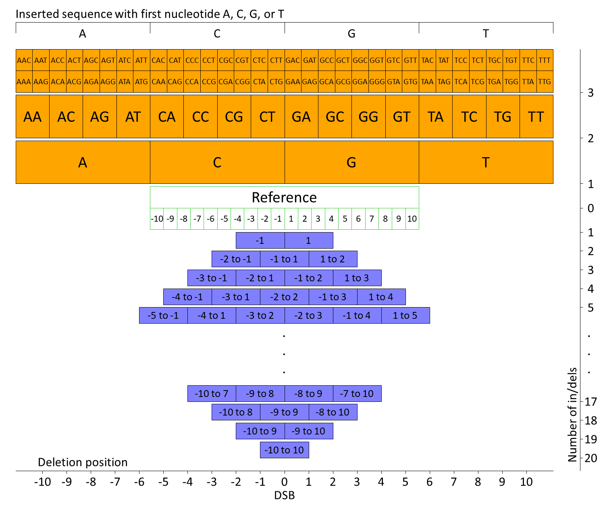
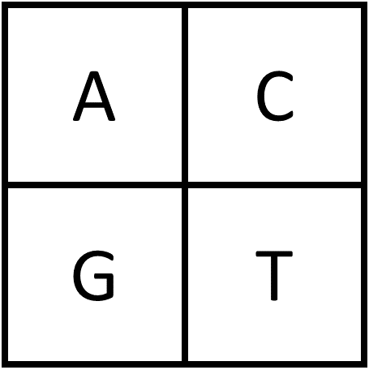
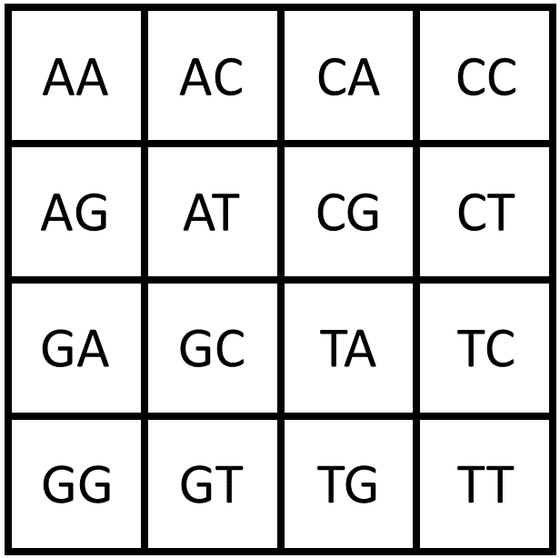

# Variation-Distance Graphs

## Introduction

This tool is intended to allow processing and visualizing high-throughput sequencing data obtained for the purpose of studying double-strand break (DSB) repair due to the nonhomologous end-joining (NHEJ) repair mechanism. The accompanying article can be found at LINK. This protocol was original used in the study Jeon et al. ([link](https://doi.org/10.1101/2022.11.01.514688)) for studying DSB repair in human cells. That publication contains several examples of the graphs in the supplementary figures, as well as a discussion of insights gained from the resulting figures.

The overall functionality of the package is to (1) preprocess DNA-seq reads that have been obtained from DSB (double-strand break) repair experiments; (2) quantify the variations (insertions, deletions, and substitutions) near the DSB site using sequence alignment; (3) visualize the resulting variations using two types of visualizations: *variation-distance graphs* and *variation-position histograms*.

The expected inputs are DNA-seq libraries that have been treated in a very specific manner to properly allowing infering the variation with alignments. For a more detailed description of the expected input, see section [Commands](#commands) and the publication associated with this software (LINK).

## Terminology

* We use the terms "vertex" and "node" interchageably for the vertices of graphs.
* We sometimes also use the term "sequence" and "alignment" interchangeably with "vertex" and "node", since, as we describe later, there is a one-to-one correspondence between these four things in the constructed graphs. For example all of the following statements may be equivalent when we refer to a single vertex in a graph:
    * The vertex has two insertions.
    * The node has two insertions.
    * The sequence has two insertions.
    * The alignment has two insertions.

## Citation

If you use this software, please use the following citation:

XXX

or in BibTex format:

XXX

## Installation

To install the package, use the command
```
pip install XXX
```
The required dependencies are
* XX
* YY
(TODO)

Bowtie 2 (version >= XX) should be installed and available on the PATH. Particularly, the executables `bowtie2-build-s` and `bowtie2-align-s` should be available as commands.

## Commands

This package is based on the following four commands:

* `preprocess.py`: takes as input the trimmed FASTQ reads files and a FASTA file containing the reference sequence, and creates the intermediate tables needed for plotting the graphs and histograms. The input directories should represent replicate experiments (e.g., biological replicates).
* `comparison.py`: takes as input two directories created by `preprocess.py` and creates a directory that contains the intermediate tables needed for plotting comparison graphs. Both of the directories must have been created with the same reference sequence.
* `graph.py`: takes as input a collection of the output directories of either `preprocess.py` or `comparison.py`, lays out alignment-sequences in all inputs, and plots a separate graph for each input.
* `histogram.py`: takes as input an output directories of `preprocess.py` (outputs of `comparison.py` are not valid) and plots a histogram showing the type and position of variations (insertions, deletion, or substitutions) in the alignment-sequences.

More information about each command is given in the following subsections. The the exposition, we use the notation `NAME` to refer to the value of a command-line parameter set by the user and the notation `--name` to refer to the parameter itself. The notation `file_name.ext` is also used to refer to file names, though the meaning should be clear from context.

### `preprocess.py`

#### Input

We expect that the input FASTQ files to `preprocess.py` are *trimmed*, meaning that the adaptors have been removed. We also expected that the region of DNA between these adaptors is exactly the region of DNA represented by the reference sequence. This mean that if a given read represents a perfectly repaired DNA strand, it should identical with the reference sequence (assuming no substitution errors due to library preparation or sequencing).

#### Substitutions in Bowtie 2

The preprocessing pipeline produces two different versions of most files: one *ignoring* substitutions (suffix "withoutSubst") and another *keeping* substitutions (suffix "withSubst"). The processing for files that ignore substitutions contains an extra step that replaces alginment subsititions (mismatches) with perfect matches with the reference sequence. We chose to ignore substitutions in our analysis because we noticed a consistent distribution of substitutions occurring in both the experiment group (where DNA double-strand breaks were induced) and the control group (where no DSBs were induced). This suggests that the majority of substitutions were likely caused by DNA damage during library preparation or sequencing errors, rather than the process of repairing double-strand breaks. In the command `graph.py`, the `--subst_type` parameter controls whether to use the output with or without substitutions. The `histogram.py` command only uses the output with substitutions, since it is partly used to examine the distribution of substitutions.

#### Prepcocessing stages

1. Align FASTQ reads against FASTA reference sequence. This stage requires multiple input FASTQ files representing independent repeats or biological/tehchnical replicates of the experimental condition. The alignment is done independently for each of the input FASTQs. The output of this steps is a set of [SAM](https://samtools.github.io/hts-specs/SAMv1.pdf) files. Please ensure that [Bowtie 2](https://bowtie-bio.sourceforge.net/bowtie2/index.shtml) is installed and that the commands `bowtie2-build-s` and `bowtie2-align-s` are available on the PATH. The output directories of this stage are:
    * `0_bowtie2_build`: The Bowtie 2 index files built with `bowtie2-build-s`.
    * `0_sam`: The SAM file output from the alignment by `bowtie2-align-s`.
2. Filter each SAM file independently using various heuristics to discard alignments that don't represent NHEJ repair. The filtering process involves the following steps:
    1. Discard alignments that represent a failed/invalid aligment in the SAM format.
    2. Discard alignments where the read sequence has length less than `MIN_LENGTH`.
    3. Discard alignment where the left-most (5'-most) position of the read does not align with the left-most position of the reference sequence.
    4. If the in/del positions of the alignment are not adjacent to or around the DSB position, try to shift them towards the DSB position in a way that keeps the number of substitutions roughly the same. If such a modification of the alignment cannot be found, discard the alignment.
    5. Finally, if the resulting alignment has in/dels that are not at consecutive positions, discard the alignment.
   If multiple reads have exactly the same nucleotide sequences but had different alignments with the reference, they will be forced to have the same alignment as the first such read encountered. Note that the left-most (5'-most) position on the read must align with the left-most position on the reference, but the same is not true for the right-most (3'-most) positions. This is because it is possible for reads to be too small and only capture the 5' primer but not the 3' primer. However, the read must have a length of at least `DSB_POS + 1`. The output is a set of tables in TSV format that contain the unique alignments and their read counts. The output is saved in files named `1_filter_nhej/[N].tsv`, where `[N]` is an integer representing the repeat number, in the same order they are specified on the command line.
3. Combine the tables output from stage 2 into a single table with multiple frequency columns, one for each input. The output will be in `2_combine_repeat/out.tsv`.
4. For each unique alignment in the output table of stage 3, extract the portion of the read that aligns to the positions `DSB_POS - WINDOW_SIZE + 1` to `DSB_POS + WINDOW_SIZE` on the reference sequence. If different reads become identical after extracting their windows, their read counts will be summed. To ensure that variations near the DSB do not spill outside the window, *anchors* must be present on either side of the extracted windows. Anchors are the parts of the read that align to the `ANCHOR_SIZE` nucleotides on the left (5') and right (3') of the window on the reference. Each anchor must have at most `ANCHOR_MISMATCHES` mismatches and no in/dels, or it is discarded. The output is a table in TSV format. The output will be in directory `3_window`, in files `window_count_withoutSubst.tsv` and `window_count_withSubst.tsv`. The "withoutSubst" version of the output has substitutions (or mismatches) in the alignment removed by replacing the incorrect nucleotide on the read with the correct nucleotide from the reference. See [here](#substitutions-in-bowtie-2) for the justification of removing substitutions.
5. Convert the raw read counts into frequencies in the range [0,1]. This is done by dividing the read counts by the total number of reads in the library. Since the total number of reads in each sample might not be exactly the sum of the read counts (e.g., if the trimming process removed some reads), the total reads are input using `--total_reads`. In this stage, the separate frequency columns for each repeat are collapsed into a single column by taking their mean. Also, alignments whose minimum frequency across the repeats is below `FREQ_MIN` will be discarded. The output will be in the subdirectory 3_window, in files:
  * `window_freq_withSubst.tsv`/`window_freq_withoutSubst.tsv`: Frequency tables with separate columns for the separate repeats.
  * `window_freq_filter_withSubst.tsv`/`window_freq_filter_withoutSubst.tsv`: The previous frequency tables with the minimum frequency filter applied.
  * `window_freq_filter_mean_withSubst.tsv`/`window_freq_filter_mean_withoutSubst.tsv`: The previous frequency tables with the separate frequency columns for the repeats collapsed into a single column by taking their mean.
6. Precompute data needed to plot the graphs, such as adjacency information and summary statistics of the graphs. The output will be in the subdirectory `4_graph`.
7. Precompute data needed to plot the histograms, such as the position and frequency of the different types of variations. The output will be in the subdirectory `5_histogram`.

#### Parameters

Output of `python preprocess.py --help`:

```
usage: preprocess.py [-h] --input INPUT [INPUT ...] --output OUTPUT --ref_seq_file REF_SEQ_FILE --dsb_pos DSB_POS [--min_length MIN_LENGTH]
                     [--window_size WINDOW_SIZE] [--anchor_size ANCHOR_SIZE] [--anchor_mismatches ANCHOR_MISMATCHES] --total_reads
                     TOTAL_READS [TOTAL_READS ...] [--freq_min FREQ_MIN] --label LABEL [--quiet]

Perform alignment and preprocessing for raw FASTQ data.

options:
  -h, --help            show this help message and exit
  --input INPUT [INPUT ...]
                        Input FASTQ files of raw reads. Each file is considered a repeat of the same experiment.
  --output OUTPUT       Output directory.
  --ref_seq_file REF_SEQ_FILE
                        FASTA file with a single nucleotide sequence.
  --dsb_pos DSB_POS     Position on reference sequence immediately left (5) of DSB site. I.e., the DSB is between position DSB_POS and        
                        DSB_POS + 1.
  --min_length MIN_LENGTH
                        Minimum length of read sequence to be considered. Reads shorter than this are discarded. Forced to be at least        
                        DSB_POS + 1.
  --window_size WINDOW_SIZE
                        Size of window around DSB site to extract. The nucleotides at the positions {DSB_POS - WINDOW_SIZE + 1, ..., DSB_POS  
                        + WINDOW_SIZE} are extracted. The actual number of nucleotides extracted from each read may vary depending on the     
                        number of insertions/deletions/substitutions in the alignment.
  --anchor_size ANCHOR_SIZE
                        Size of the anchor on the left/right of the extracted window to check for mismatches.
  --anchor_mismatches ANCHOR_MISMATCHES
                        Maximum number of mismatches allowed on the left/right anchor sequences. Reads with more than the allowed number of   
                        mismatches on the left/right anchor will be discarded. This limit is applied to the left/right anchors separately.    
  --total_reads TOTAL_READS [TOTAL_READS ...]
                        Total number reads in each experiment. This may be strictly greater than the number of reads in the input FASTQ       
                        files if some reads were discarded during preprocessing. The number of arguments must be the same as the number of    
                        INPUTs.
  --freq_min FREQ_MIN   Minimum frequency for output in windows_freq_filter_mean. Sequences with frequencies <= this are discarded.
  --label LABEL         Label of the experiment to be used in plot legends.
  --quiet               If present, do no output verbose log message.
```

Please reference to CITATION for more details about the preprocessing.

### `comparison.py`

This stages creates data needed to compare two different sequencing libraries. Specifically, it takes as input two directories that were created using the `preprocess.py` script, and will output a third directory that contains analogous data for creating comparison graphs of the two samples. For meaningful comparisons, it is important that the reference sequences (after restricting to the specified window) are identical between the two libraries. The output data will contain the same columns as that output from `preprocess.py` (i.e., it will have the same information about the variations around the DSBs), but will have two additional columns (with suffixes `_1` and `_2`) for the frequencies of the two different samples being compared. The original frequency column, with no suffix, will contain the maximum of these two frequencies. The output will be in the subdirectories `3_window`, `4_graph`, and `5_histogram`.

Output of `python comparison.py --help`:
```
usage: comparison.py [-h] --input INPUT INPUT --output OUTPUT

Combine two individual experiment directories to make a comparison experiment directory for comparison graphs. The experiments must
be have the same windowed reference sequence.

options:
  -h, --help           show this help message and exit
  --input INPUT INPUT  Input directories of data created with "preprocess.py".
  --output OUTPUT      Output directory.
```

### `graph.py`

This command performs the vertex layout and final plotting of the variation-distance graphs. Multiple inputs may be specified to layout the vertices jointly, as long as their windowed reference sequences are identical. See the [Graphs](#graphs) section for a description of the meaning of different visual properties of the graph (e.g., edges, vertex sizes, colors, etc.).

Output of `python graph.py --help`:

```
usage: graph.py [-h] --input INPUT [INPUT ...] [--output OUTPUT [OUTPUT ...]] [--title TITLE [TITLE ...]]
                [--layout {mds_layout,radial_layout,universal_layout,fractal_layout,kamada_layout,spectral_layout,spring_layout,shell_layout,spiral_layout,circular_layout,multipartite_layout}]
                [--universal_layout_y_axis_x_pos UNIVERSAL_LAYOUT_Y_AXIS_X_POS]
                [--universal_layout_x_axis_deletion_y_pos UNIVERSAL_LAYOUT_X_AXIS_DELETION_Y_POS]
                [--universal_layout_x_axis_deletion_label_type {relative,absolute}]
                [--universal_layout_x_axis_insertion_y_pos UNIVERSAL_LAYOUT_X_AXIS_INSERTION_Y_POS]
                [--universal_layout_y_axis_y_range UNIVERSAL_LAYOUT_Y_AXIS_Y_RANGE UNIVERSAL_LAYOUT_Y_AXIS_Y_RANGE]
                [--universal_layout_x_axis_x_range UNIVERSAL_LAYOUT_X_AXIS_X_RANGE UNIVERSAL_LAYOUT_X_AXIS_X_RANGE]
                [--universal_layout_y_axis_deletion_max_tick UNIVERSAL_LAYOUT_Y_AXIS_DELETION_MAX_TICK]
                [--universal_layout_y_axis_insertion_max_tick UNIVERSAL_LAYOUT_Y_AXIS_INSERTION_MAX_TICK]
                [--universal_layout_x_scale_insertion UNIVERSAL_LAYOUT_X_SCALE_INSERTION]
                [--universal_layout_y_scale_insertion UNIVERSAL_LAYOUT_Y_SCALE_INSERTION]
                [--universal_layout_x_scale_deletion UNIVERSAL_LAYOUT_X_SCALE_DELETION]
                [--universal_layout_y_scale_deletion UNIVERSAL_LAYOUT_Y_SCALE_DELETION] [--subst_type {withSubst,withoutSubst}]
                [--node_freq_range NODE_FREQ_RANGE NODE_FREQ_RANGE] [--node_px_range NODE_PX_RANGE NODE_PX_RANGE]
                [--node_outline_scale NODE_OUTLINE_SCALE] [--node_comparison_colors NODE_COMPARISON_COLORS NODE_COMPARISON_COLORS]
                [--node_comparison_color_type {continuous,discrete}] [--node_freq_ratio_range NODE_FREQ_RATIO_RANGE NODE_FREQ_RATIO_RANGE]    
                [--node_reference_outline_color NODE_REFERENCE_OUTLINE_COLOR] [--node_outline_color NODE_OUTLINE_COLOR]
                [--node_fill_color NODE_FILL_COLOR]
                [--variation_types {insertion,deletion,substitution,mixed,none} [{insertion,deletion,substitution,mixed,none} ...]]
                [--variation_type_colors VARIATION_TYPE_COLORS VARIATION_TYPE_COLORS VARIATION_TYPE_COLORS VARIATION_TYPE_COLORS VARIATION_TYPE_COLORS]
                [--edge_show {True,False}] [--edge_types {indel,substitution} [{indel,substitution} ...]] [--edge_scale EDGE_SCALE]
                [--stats] [--width_px WIDTH_PX] [--height_px HEIGHT_PX] [--margin_top_px MARGIN_TOP_PX]
                [--margin_bottom_px MARGIN_BOTTOM_PX] [--margin_left_px MARGIN_LEFT_PX] [--margin_right_px MARGIN_RIGHT_PX]
                [--line_width_scale LINE_WIDTH_SCALE] [--font_size_scale FONT_SIZE_SCALE] [--crop_x CROP_X CROP_X] [--crop_y CROP_Y CROP_Y]   
                [--range_x RANGE_X RANGE_X] [--range_y RANGE_Y RANGE_Y] [--legend] [--legend_colorbar_scale LEGEND_COLORBAR_SCALE]
                [--legend_spacing_px LEGEND_SPACING_PX] [--separate_components] [--interactive] [--reverse_complement {0,1} [{0,1} ...]]      

Lay out and plot variation-distance graphs. Uses the output from "get_graph_data" as input. For more information about the layouts please     
see the publication FIXME.

options:
  -h, --help            show this help message and exit
  --input INPUT [INPUT ...]
                        List of directories with the data files produced with "get_graph_data.py". All libraries specified here must have     
                        the same windowed reference sequence (i.e., the 20bp section of the reference around the DSB site should be the same  
                        in all libraries). All the libraries will be laid out using common x/y-coordinate assignments to the vertices.        
                        (default: None)
  --output OUTPUT [OUTPUT ...]
                        Output file. If not given no output will be written (useful only when using "--interactive"). The file extension      
                        should be either ".png" or ".html" for a static PNG or interactive HTML output respectively. Should be either 0       
                        arguments or the number of arguments should match the number of input directories. (default: None)
  --title TITLE [TITLE ...]
                        If present, adds a title to the plot with this value. Number of arguments should match the number of input files.     
                        (default: None)
  --layout {mds_layout,radial_layout,universal_layout,fractal_layout,kamada_layout,spectral_layout,spring_layout,shell_layout,spiral_layout,circular_layout,multipartite_layout}
                        The algorithm to use for laying out the graph. (default: universal_layout)
  --universal_layout_y_axis_x_pos UNIVERSAL_LAYOUT_Y_AXIS_X_POS
                        If present, shows a y-axis at the given x position showing the distances to the reference. Univeral layout only.      
                        (default: None)
  --universal_layout_x_axis_deletion_y_pos UNIVERSAL_LAYOUT_X_AXIS_DELETION_Y_POS
                        If present, shows an x-axis for deletions at the given y position showing the approximate position of the deleted     
                        ranges. Univeral layout only. (default: None)
  --universal_layout_x_axis_deletion_label_type {relative,absolute}
                        The type of labeling to use for the universal layout deletion x-axis (if present). "relative" labels have 0 in the    
                        middle with negative/positive values on the left/right. "absolute" labels have 1 on the left and the length of the    
                        reference sequence on the right. (default: relative)
  --universal_layout_x_axis_insertion_y_pos UNIVERSAL_LAYOUT_X_AXIS_INSERTION_Y_POS
                        If present, shows a x-axis for insertions at the given y position showing the first nucleotide of inserted
                        sequences. Univeral layout only. (default: None)
  --universal_layout_y_axis_y_range UNIVERSAL_LAYOUT_Y_AXIS_Y_RANGE UNIVERSAL_LAYOUT_Y_AXIS_Y_RANGE
                        If showing an y-axis for the universal layout, the min and max y-position of the line. (default: [nan, nan])
  --universal_layout_x_axis_x_range UNIVERSAL_LAYOUT_X_AXIS_X_RANGE UNIVERSAL_LAYOUT_X_AXIS_X_RANGE
                        If showing an x-axis for the universal layout, the min and max x-position of the line. (default: [nan, nan])
  --universal_layout_y_axis_deletion_max_tick UNIVERSAL_LAYOUT_Y_AXIS_DELETION_MAX_TICK
                        If showing an y-axis for the universal layout, the max tick value for the deletion side. (default: None)
  --universal_layout_y_axis_insertion_max_tick UNIVERSAL_LAYOUT_Y_AXIS_INSERTION_MAX_TICK
                        If showing an y-axis for the universal layout, the max tick value for the insertion side. (default: None)
  --universal_layout_x_scale_insertion UNIVERSAL_LAYOUT_X_SCALE_INSERTION
                        The factor for determining the scale on the universal layout insertion x-axis. Insertion vertex x-coordinates will    
                        be multiplied by this value. (default: 10)
  --universal_layout_y_scale_insertion UNIVERSAL_LAYOUT_Y_SCALE_INSERTION
                        The factor for determining the scale on the universal layout insertion y-axis. Insertion vertex y-coordinates will    
                        be multiplied by this value. (default: 3)
  --universal_layout_x_scale_deletion UNIVERSAL_LAYOUT_X_SCALE_DELETION
                        The factor for determining the scale on the universal layout deletion x-axis. Deletion vertex x-coordinates will be   
                        multiplied by this value. (default: 2)
  --universal_layout_y_scale_deletion UNIVERSAL_LAYOUT_Y_SCALE_DELETION
                        The factor for determining the scale on the universal layout deletion y-axis. Deletion vertex y-coordinates will be   
                        multiplied by this value. (default: 1)
  --subst_type {withSubst,withoutSubst}
                        Whether to plot data with or without substitutions. (default: withoutSubst)
  --node_freq_range NODE_FREQ_RANGE NODE_FREQ_RANGE
                        Min and max frequency to determine node size. Higher frequencies are clipped to this value. (default: [1e-05, 1])     
  --node_px_range NODE_PX_RANGE NODE_PX_RANGE
                        Largest node size as determined by the frequency. (default: [10, 120])
  --node_outline_scale NODE_OUTLINE_SCALE
                        How much to scale the node outline width (thickness). Values > 1 increase the width; values < 1 decrease the width.   
                        (default: 4)
  --node_comparison_colors NODE_COMPARISON_COLORS NODE_COMPARISON_COLORS
                        The colors to use in the gradient when the node colors show the frequency ratio of two experiments. May be specified  
                        in hex (e.g., "#ff0000" for red) or with recognized keywords such as "red", "blue", "green". (default: ['#ff0000',    
                        '#0000ff'])
  --node_comparison_color_type {continuous,discrete}
                        The type of color scheme to use for coloring nodes in a comparison graph. The "continuous" scheme uses a gradient of  
                        colors from the min to max ratio. The "discrete" schemes uses three colors to indicate that the ratio is < the min    
                        ratio, between the min and max ratio, or > the max ratio. The min and max ratios are determined by
                        NODE_FREQ_RATIO_RANGE and the corresponding colors are determined by NODE_COMPARISON_COLORS. (default: continuous)    
  --node_freq_ratio_range NODE_FREQ_RATIO_RANGE NODE_FREQ_RATIO_RANGE
                        The two frequencies used to determine node colors for comparison graphs. Also controls the range of ratios displayed  
                        on the frequency-ratio colorbar legend. Typically, the min value should be < 1 and the max value should be > 1.       
                        (default: [0.6666666666666666, 1.5])
  --node_reference_outline_color NODE_REFERENCE_OUTLINE_COLOR
                        Color to make the reference node outline. May be specified in hex (e.g., "#ff0000" for red) or with recognized        
                        keywords such as "red", "blue", "green". (default: #32cd32)
  --node_outline_color NODE_OUTLINE_COLOR
                        Color to make the default node outline. May be specified in hex (e.g., "#ff0000" for red) or with recognized
                        keywords such as "red", "blue", "green". (default: #000000)
  --node_fill_color NODE_FILL_COLOR
                        Color to make the default node fill. May be specified in hex (e.g., "#ff0000" for red) or with recognized keywords    
                        such as "red", "blue", "green". (default: #ffffff)
  --variation_types {insertion,deletion,substitution,mixed,none} [{insertion,deletion,substitution,mixed,none} ...]
                        The variation types that should be included in the graph. This should be a list of the types: "insertion",
                        "deletion", "substitution", "mixed", "none". Default value: "insertion", "deletion", "none". "mixed" means nodes      
                        that have multiples variation types (e.g. insertions and substitutions). "none" means the reference node (no
                        variations). May be specified in hex (e.g., "#ff0000" for red) or with recognized keywords such as "red", "blue",     
                        "green". (default: ['insertion', 'deletion', 'substitution', 'mixed', 'none'])
  --variation_type_colors VARIATION_TYPE_COLORS VARIATION_TYPE_COLORS VARIATION_TYPE_COLORS VARIATION_TYPE_COLORS VARIATION_TYPE_COLORS       
                        The colors for the different variations types. They must be specified in the order: INSERTION DELETION SUBSTITUTION   
                        MIXED NONE. MIXED is the color for nodes with multiple types of variations (e.g. insertions and substitutions); NONE  
                        is the color for the reference node (no variations). May be specified in hex (e.g., "#ff0000" for red) or with        
                        recognized keywords such as "red", "blue", "green". (default: ['#ffa500', '#8080ff', '#808080', '#00ff00',
                        '#ffffff'])
  --edge_show {True,False}
                        Whether to show edges between nodes. (default: True)
  --edge_types {indel,substitution} [{indel,substitution} ...]
                        The edge types to show. (default: ['indel'])
  --edge_scale EDGE_SCALE
                        How much to scale the edges width (thickness). Values > 1 increase the width; values < 1 decrease the width.
                        (default: 8)
  --stats               If present, show graph summary statistics in the left margin. (default: False)
  --width_px WIDTH_PX   The width of the plot in pixels. (default: 2400)
  --height_px HEIGHT_PX
                        The height of the plot in pixels. (default: 2400)
  --margin_top_px MARGIN_TOP_PX
                        The size of the top margin in pixels. (default: 300)
  --margin_bottom_px MARGIN_BOTTOM_PX
                        The size of the bottom margin in pixels. (default: 300)
  --margin_left_px MARGIN_LEFT_PX
                        The size of the left margin in pixels. (default: 300)
  --margin_right_px MARGIN_RIGHT_PX
                        The size of the right margin in pixels. (default: 300)
  --line_width_scale LINE_WIDTH_SCALE
                        How much to scale the line widths (aka thickness). Values > 1 increase the width; values < 1 decrease the width.      
                        (default: 8)
  --font_size_scale FONT_SIZE_SCALE
                        How much to scale the colorbar legend (for frequency-ratio coloring). (default: 4)
  --legend_spacing_px LEGEND_SPACING_PX
                        Amount of vertical space in pixels between different legends. (default: 200)
  --separate_components
                        If present, separate the connected components of the graph. (default: False)
  --interactive         If present opens the interactive version in a browser. Uses the Ploty library figure.show() function to do so.        
                        (default: False)
  --reverse_complement {0,1} [{0,1} ...]
                        Whether to reverse complement the sequences in the data sets. If present, the number of values must be the same as    
                        the number of input directories. "1" mean reverse complement the sequence and "0" means do not. Used for making a     
                        layout for data sets that have reference sequences that are the reverse complements of each other. If "1" also uses   
                        the reverse complement of sequences when determining the display labels and hover text. This affects the universal    
                        layout and fractal layout. (default: None)
```

### `histogram.py`

This commands plots the 3D histograms, which summarize the distribution of the variations in the windows around the DSB site. Each histogram shows a single type of variation (insertion, deletion, or substitution), which is determined by the `--variation_type` parameter. The axes are described in the following.

* The position of each variation is shown on the $x$-axis of the graphs. The position can be measured in two ways: (1) relative to the position of the DSB, or (2) relative to the 5'-end of the window. Which of these two options is used depends on the value of the `--label_type` parameter. For deletions and substitutions, the position of the variation is unambiguous and corresponds to a specific position on the reference sequence. However, for insertions, the position is assigned to the left (5') position of the two consecutive positions around the DSB on the reference sequence, as the insertion occurs between these two positions.
* The $y$-axis indicates the total number of in/dels on the sequence that the variation originated from.
* The $z$-axis indicates the total frequency of the variations with the given $x$- and $y$-coordinates.

To understand how the frequencies are calculated, consider the following example: Suppose an alignment in the data had one insertion at position 5, two deletions at positions 6 and 7, and an overall frequency of 0.1. Let's assume that the DSB is between positions 5 and 6, and that we are using relative labeling on the $x$-axis. In the insertion histogram, the alignment would contribute +0.1 to the z-value of the bar at the $x$-$y$-coordinate (-1, 3).  In the deletion histogram, the alignment would contribute +0.1 to the z-value of the bars at the $x$-$y$-coordinates (1, 3) and (2, 3). If we used absolute labeling, then the respective $x$-$y$-coordinates would be (5, 3), (6, 3), and (7, 3), since the positions are now labeled according to their absolute positions on the reference sequence.

Output of `histogram.py --help`:

```
usage: histogram.py [-h] --input INPUT --output OUTPUT --variation_type {substitution,insertion,deletion} [--reverse_pos] --label_type
                    {relative,absolute} [--color COLOR] [--freq_range FREQ_RANGE FREQ_RANGE] [--freq_scale {linear,log}]

Plot 3d histograms showing variation type/position/frequency.

options:
  -h, --help            show this help message and exit
  --input INPUT         Directory with the data files. (default: None)
  --output OUTPUT       Output image file. Must have extension ".png". (default: None)
  --variation_type {substitution,insertion,deletion}
                        Which variation type to show in the histogram. (default: None)
  --reverse_pos         Whether to reverse the x-axis positions. Useful if comparing reverse strand data with forward strand data. (default:
                        False)
  --label_type {relative,absolute}
                        Whether to index the x-axis by "absolute" positions on the reference sequence from 1 to [reference length], or        
                        "relative" positions from -[reference length]/2 to [reference length]/2 (skipping 0). [reference length] refers to    
                        the length of the reference sequence after extracting the window around the DSB site. (default: None)
  --color COLOR         Color of the bar graph. If not specified, a default color based on VARIATION_TYPE will be chosen. (default: None)     
  --freq_range FREQ_RANGE FREQ_RANGE
                        Range of the z-axis frequency values to show. (default: [1e-05, 1])
  --freq_scale {linear,log}
                        Whether to use a linear or log scale for the z-axis frequency values. (default: log)
```

## Graphs

In this section, we will explain the visual elements of the output graphs generated by the `graph.py` command. Please note that we use the terms "sequence" and "vertex" interchangeably, as there is a one-to-one correspondence between the windowed sequences produced by the [`preprocess.py`](#preprocesspy) script and the vertices of the graph. For instance, when we say "the two vertices differ by a single insertion", we actually mean "the two sequences corresponding to the two vertices differ by a single insertion".

### Layouts

Different *layouts*, specified with the `--layout` parameter, are used to position the vertices. We describe a subset of them in the following.

* Kamada-Kawaii: The Kamada-Kawaii algorithm is a physical simulation algorithm used for laying out graphs (Kamada and Kawai, 1989). In this algorithm, the graph is represented as a spring system where each pair of vertices is connected by a spring whose resting length is proportional to the shortest-path distance between the vertices. The algorithm works by finding the optimal positions of the vertices that minimize the energy of the system. The result is a layout that is both aesthetically pleasing and reveals the graph structure, such as clusters of vertices that are close together. The [NetworkX](#https://networkx.org/) Python package (Hagberg, 2008) implements this algorithm, and as of this writing, it initializes the vertices in a circle. Note that the shortest-path distance between two vertices is at least as large as the Levenshtein distance between them, but it doesn't have to be equal. The final positions of the vertices are always in the range [0, 1], which is important to keep in mind when setting the `--plot_range_x` and `--plot_range_y` parameters.
* Universal layout: We refer to this layout as the "universal" layout because it assigns a predefined position to every possible insertion and deletion, regardless of the subset of insertions and deletions present in the dataset. In contrast to the Kamada-Kawai algorithm, which positions vertices in a data-dependent manner, this layout algorithm is less flexible but highly interpretable and reproducible. This layout also only applies to data *without* substitutions, set with `--subst_type withoutSubst`. The universal layout places the reference vertex at the center of the figure, with insertion vertices above and deletion vertices below. For both insertion and deletion vertices, the $y$-coordinate is determined by the Levenshtein distance between the vertex's sequence and the reference sequence, which is simply the number of nucleotides inserted or deleted in the vertex's sequence. If a vertex's Levenshtein distance is $d$, then deletion vertices are placed $d$ units below the reference, while insertion vertices are placed $d$ units above. The $x$-coordinates of vertices are determined using different rules for insertions and deletions. Insertion vertices are ordered from left to right by alphabetical order, while deletion vertices are ordered from left to right based on the positions of the deleted nucleotides with respect to the DSB site. Figure 1 provides a key to the vertex placement in the universal layout. In this layout, the vertex coordinates typically range between $\pm 2 * window\_size$, where $window\_size$ is a parameter from preprocess.py (this is relevant if you set the `--plot_range_x` and `--plot_range_y` parameters). However, the scaling on the insertion and deletion, $x$ and $y$-coordinates can be controlled by the `--universal_layout_x_scale_insertion`, `--universal_layout_y_scale_insertion`, `--universal_layout_x_scale_deletion`, and `--universal_layout_y_scale_deletion` parameters.
* Radial: This layout arranges the vertices in concentric circles around the reference sequence. The reference vertex is positioned at the center of the figure, while the insertion and deletion vertices are placed above and below the reference, respectively. The Levenshtein distance between a vertex and the reference determines its physical distance from the reference vertex. For instance, vertices with a Levenshtein distance of 1 are placed in the first concentric circle around the reference, and those with a Levenshtein distance of 2 are placed in the second circle, and so on. In each circle, insertion vertices are arranged in a clockwise direction based on their frequency, with the most frequent vertex at the top, while deletion vertices are arranged in a counterclockwise direction, also based on their frequency, with the most frequent vertex at the bottom. To ensure that the vertices do not overlap and edges are not collinear, several heuristics are used to perturb the vertices slightly. The vertex coordinates in this layout usually range between $\pm 4 * window\_size$, where $window\_size$ is the parameter from `preprocess.py` (relevant when setting the `--plot_range_x` and `--plot_range_y` parameters).
* Fractal: The fractal layout is designed to display only the insertion vertices in an alignment. Vertices with a single inserted nucleotide (A, C, G, or T) are positioned in the center of the corresponding quadrant shown in Figure 2. Specifically, A is in the top-left quadrant, C is in the top-right quadrant, G is in the bottom-left quadrant, and T is in the bottom-right quadrant. For vertices with two inserted nucleotides, they are positioned in the center of the corresponding square shown in Figure 3. The pattern for two-nucleotide insertions starting with A involves subdividing the A square into four quadrants and arranging AA, AC, AG, and AT based on their second nucleotide in the same order as the original A, C, G, T squares. Specifically, AA is in the top-left quadrant, AC is in the top-right quadrant, AG is in the bottom-left quadrant, and AT is in the bottom-right quadrant. This pattern can be extended to arbitrarily large kmers. For a kmer $s_1 s_2 \cdots s_k$, the corresponding square will be obtained by subdividing the square for $s_1 s_2 \cdots s_{k-1}$ into four quadrants and choosing the quadrant in the same way as before based on $s_k$. This layout is similar to the insertion side of the universal layout, but the inserted sequences are arranged in a two-dimensional form instead of linearly from left to right. The final coordinates of the vertices are always in the range [-1, 1], which is relevant when setting the `--plot_range_x` and `--plot_range_y` parameters.


*Figure 1: Universal layout vertex placement key.*


*Figure 2: Fractal layout vertex placement for insertions of length 1. The vertices is placed in the certer of the square corresponding to its inserted string.*


*Figure 2: Fractal layout vertex placement for insertions of length 2. Each square for the length 1 insertions are subdivided into 4 new squares. The vertices is placed in the certer of the square corresponding to its inserted string.*

### Graph aesthetics

In this section, we describe the visual feature of the graphs.

* Vertices:
  * Size: For an individual graph, the vertex radius is a function of the log-frequency. This is controlled by the parameters `--node_freq_range` and `--node_px_range`. Vertices with frequencies $\leq$ `NODE_FREQ_RANGE[0]` get `NODE_PX_RANGE[0]` and frequencies $\geq$ `NODE_FREQ_RANGE[1]` get `NODE_PX_RANGE[1]`. Frequencies in between get a radius that varies linearly with the log-frequency.
  * Outline: The outline color is intended to differentiate the reference sequence vertex from the other vertices. The colors are determined by the `--node_reference_outline_color` and `--node_outline_color` parameters.
  * Color: The vertex color is determined by the following modes:
    * Variation type: This mode is only for individual graphs. This mode gives vertices a color depending on the type of variations present in their alignment: insertions only, deletions only, substitutions only, mixed (which is a combinations of insertions, deletions, and substitution), and none (which represents the reference sequence). These colors can be defined by using the `--variation_type_colors` parameter.
    * Frequency ratio (continuous): This mode is only used for comparison graphs, and can be activated by setting the parameter `--node_comparison_color_type continuous`. In this mode, a color gradient is used for each vertex to indicate the frequency ratio of the vertex between the two experiments being compared. The ratio is calculated by putting the vertex's frequency in the first sample in the numerator and the vertex's frequency in the second sample in the denominator (the order is determined during preprocessing). The colors at the two ends of the gradient are specified by the `--node_comparison_colors` parameter, while the colors in between are smoothly interpolated based on the frequency ratio. The range of ratios at the two ends of the gradient is determined by the `--node_freq_ratio_range` parameter.
    * Frequency ratio (discrete): This mode is only used for comparison graphs, and can be activated by setting the parameter `--node_comparison_color_type discrete`. In this mode, three colors are used to indicate the frequency ratio of the vertex between the two experiments being compared. If the frequency ratio is less than `NODE_FREQ_RATIO_RANGE[0]`, the color `NODE_COMPARISON_COLORS[1]` is displayed (meaning higher in sample 2). If the frequency ratio is greater than `NODE_FREQ_RATIO_RANGE[1]`, the color `NODE_FREQ_RATIO_RANGE[1]` is displayed (meaning higher in sample 1). If the frequency ratio is between `NODE_FREQ_RATIO_RANGE[0]` and `NODE_FREQ_RATIO_RANGE[1]` (inclusive), the vertex is colored white.
* Edges: All edges in the graph indicate a 1-nucleotide variation (insertion, deletion, or substitution) between the two vertices that are connected. The display of edges and which types of edges to show can be controlled by using the `--edge_show` and `--edge_types` parameters.
* Legends: The legends describe the vertex size, vertex outline, vertex color, and the edges. These can be all drawn by using the `--legend` parameter. The legends will be drawn in the right margin of the figure. To ensure enough room, use the `--margin_top_px`, `--margin_bottom_px`, `--margin_left_px`, and `--margin_right_px` parameters. The different legends are laid out vertically. To control the spacing between them use the `--legend_spacing_px` parameter.
* Title: A title can be optionally added to the top margin of the figure using the `--title` parameter.
* Universal layout axes: To illustrate the vertex placement for the universal layout, axes can be drawn on the figure. Using the `--universal_layout_x_axis_deletion_y_pos` parameter, a horizontal axis can be drawn on the deletion side (below the reference sequence), which, for each deletion vertex, shows the approximate position of the range of deleted nucleotides (see [Figure 1](#graphs)) for mode details. Using the `--universal_layout_x_axis_insertion_y_pos` parameter, a horizontal axis can be drawn on the insertion side (above the reference sequence) to show the alphabetical order of the nucleotides. Using the `--universal_layout_y_axis_x_pos` parameter, a vertical axis can be drawn to show the Levenshtein distance of vertices from the reference vertex. There are several other parameters to control various aspects of the axes: `--universal_layout_x_axis_deletion_label_type`, `--universal_layout_y_axis_y_range`, `--universal_layout_x_axis_x_range`, `--universal_layout_y_axis_deletion_max_tick`, and `--universal_layout_y_axis_insertion_max_tick`. The following are used to scale the axes by different amount, mostly for the purpose of aesthetics: `--universal_layout_x_scale_insertion`, `--universal_layout_y_scale_insertion`, `--universal_layout_x_scale_deletion`, and `--universal_layout_y_scale_deletion`. To help positioning the axes, a message is printed to the console showing the range of $x$- and $y$-coordinates for each figure, when `graph.py` is run.
* Graph statistics: The `--stats` parameter can be used to display summary statistics of the graph in the left margin of the figure. If the graph has more than one connected component, the component containing the reference sequence is the only one used since the pairwise distance between vertices is not well-defined otherwise. To ensure that the left margin has enough space to display the summary statistics, the `--margin_left_px` parameter can be used.

## Tutorial

Several example input files are available in the `data_input` directory:

* `data_input/ref_seq`: reference sequence FASTA files, representing the perfect repaired sequence for different experiments.
* `data_input/fastq`: high-throughput sequencing data in FASTQ format for different samples. Each FASTQ file corresponds to an independent experiment.

Note that the FASTQ samples have been *trimmed*, meaning that we only capture the portion of the read between the adaptors, and low-quality reads have been already filtered out.

### Tutorial: Preprocessing

The [`preprocess.py`](#preprocesspy) command must be run before producing any figures. This stage aligns the input FASTQ files against the reference sequences, extracts the part of the alignment around the DSB position, and creates tables of the unique alignments and their frequencies. The following are examples of using the command:

```
python preprocess.py --input data_input/fastq/sense1_R1.fq data_input/fastq/sense2_R1.fq data_input/fastq/sense3_R1.fq data_input/fastq/sense4_R1.fq --ref_seq_file data_input/ref_seq/2DSB_R1_sense.fa --dsb_pos 67 --output data_output/sense_R1 --label sense_R1 --total_reads 3000 3000 3000 3000
python preprocess.py --input data_input/fastq/sense1_R2.fq data_input/fastq/sense2_R2.fq data_input/fastq/sense3_R2.fq data_input/fastq/sense4_R2.fq --ref_seq_file data_input/ref_seq/2DSB_R2_sense.fa --dsb_pos 46 --output data_output/sense_R2 --label sense_R2 --total_reads 3000 3000 3000 3000
python preprocess.py --input data_input/fastq/db1_R1.fq data_input/fastq/db2_R1.fq data_input/fastq/db3_R1.fq data_input/fastq/db4_R1.fq --ref_seq_file data_input/ref_seq/2DSB_R1_branch.fa --dsb_pos 67 --output data_output/db_R1 --label db_R1 --total_reads 3000 3000 3000 3000
python preprocess.py --input data_input/fastq/db1_R2.fq data_input/fastq/db2_R2.fq data_input/fastq/db3_R2.fq data_input/fastq/db4_R2.fq --ref_seq_file data_input/ref_seq/2DSB_R2_branch.fa --dsb_pos 46 --output data_output/db_R2 --label db_R2 --total_reads 3000 3000 3000 3000
python preprocess.py --input data_input/fastq/dcmv1_R1.fq data_input/fastq/dcmv2_R1.fq data_input/fastq/dcmv3_R1.fq data_input/fastq/dcmv4_R1.fq --ref_seq_file data_input/ref_seq/2DSB_R1_cmv.fa --dsb_pos 67 --output data_output/dcmv_R1 --label dcmv_R1 --total_reads 3000 3000 3000 3000
python preprocess.py --input data_input/fastq/dcmv1_R2.fq data_input/fastq/dcmv2_R2.fq data_input/fastq/dcmv3_R2.fq data_input/fastq/dcmv4_R2.fq --ref_seq_file data_input/ref_seq/2DSB_R2_cmv.fa --dsb_pos 46 --output data_output/dcmv_R2 --label dcmv_R2 --total_reads 3000 3000 3000 3000
```

There are 24 files in the `data_input/fastq` directory, but we only run the preprocessing pipeline six times. This is because we process the biological repeats of each experiment together. For instance, `sense1_R1.fq`, `sense2_R1.fq`, `sense3_R1.fq`, and `sense4_R1.fq` are all biological repeats of the "Sense, 2-DSB" experiment. The `R1` or `R2` in the file names indicate whether the forward or reverse strand of the read was sequenced.

It's important that all the biological repeats for each experiment use the same reference sequence. For example, the four "Sense, 2-DSB" experiments in the examples use the `2DSB_R1_sense.fa` reference sequence.

The output of the preprocessing pipeline will be a collection of tables in TSV (tab-separated value) format. The most significant files are located in the  `4_graph` and `5_histogram` subdirectories, which contain data used for plotting graphs and histograms, respectively. Other intermediate preprocessing files are stored in other subdirectories.

If you need more information about the parameters used in the preprocessing pipeline, you can use the command `python preprocess.py --help`. You can also see the `preprocess.py` section for more details.

### Tutorial: Comparisons

The [comparison](#comparisonpy) script is used to combine two outputs directories of the [preprocessing](#preprocesspy) command for plotting [comparison graphs](#XX). The following are examples:

```
python comparison.py --input data_output/sense_R1 data_output/db_R1 --output data_output/sense_db_R1
python comparison.py --input data_output/sense_R2 data_output/db_R2 --output data_output/sense_db_R2
python comparison.py --input data_output/sense_R1 data_output/dcmv_R1 --output data_output/sense_dcmv_R1
python comparison.py --input data_output/sense_R2 data_output/dcmv_R2 --output data_output/sense_dcmv_R2
```

Note that both experiments must have identical reference sequences after extracting its `2 * WINDOW_SIZE` nucleotides around the DSB position. The whole reference sequences (i.e., the files in the `--ref_seq` parameter to `preprocess.py`) need not be identical so long as this window is.

The output will have a directory structure mirroring the output of `preprocess.py`, except that only the subdirectories `3_window`, `4_graph`, and `5_histogram` will be present (since there is no need to cache the other preprocessing data). The output files contain a combination of the data from both the experiments for creating comparison graphs.

### Tutorial: Graphing

The [`graph.py`](#graphpy) script is used to layout and plot the aligned reads output from the [`preprocess.py`](#preprocesspy) and [`comparison.py`] scripts, into. The input should be a list of directories created by `preprocess.py`/`comparison.py` and the output will be PNG or HTML files that visually represent the graph of sequences extracted from reads around the DSB position. The graphs are represented as a scatter-plot of vertices (representing sequences) and edges (representing single-variation sequence similarity).

Multiple inputs may be specified as long as all the experiments have identical reference sequences (potentially after reverse-complementing; see the `--reverse_complement` parameter) within the DSB window. When multiple inputs are specified, all sequences (potentially after reverse complementing) in all the inputs are combined into a single "supergraph". The supergraph is laid out to determine the coordinates of each vertex. Then the graphs of each input (which are subgraphs of the supergraph) are laid out separately according to the coordinates determined by the supergraph. This allows the output figures for each experiment to have the same coordinates for the same sequence, which aids visual comparison between experiments.

The output may be either PNG or HTML. HTML output may be opened in a browser and allows interactive inspection of the vertices by hovering over them.

To plot individual graphs (graphs with a single experiment), the output directories of `preprocess.py` should be used. To plot comparison graphs (graphs comparing two experiments), the output directories of `comparison.py` should be used.

There are many parameters for customizing the aesthetics of the output graphs, which are covered in more detail in section [Graphs](#graphs).

The following are example commands of using `graph.py` with a single input directory:

```
python graph.py --input data_output/db_R1 --output plot/graph/universal/db_R1.png --legend --layout universal_layout --width 2400 --height 1800 --range_x -12 13 --range_y -23 20 --universal_layout_y_axis_x_pos 12 --universal_layout_y_axis_y_range -20.5 18.5 --universal_layout_x_axis_deletion_y_pos -20.5 --universal_layout_x_axis_insertion_y_pos 18.5  --universal_layout_y_axis_insertion_max_tick 6 --universal_layout_y_axis_deletion_max_tick 19
python graph.py --input data_output/db_R2 --output plot/graph/universal/db_R2.png --layout universal_layout --width 2400 --height 1800 --range_x -12 13 --range_y -23 20 --universal_layout_y_axis_x_pos 12 --universal_layout_y_axis_y_range -20.5 18.5 --universal_layout_x_axis_deletion_y_pos -20.5 --universal_layout_x_axis_insertion_y_pos 18.5 --universal_layout_y_axis_insertion_max_tick 6 --universal_layout_y_axis_deletion_max_tick 19
python graph.py --input data_output/sense_R1 --output plot/graph/universal/sense_R1.png --layout universal_layout --width 2400 --height 1800 --range_x -12 13 --range_y -23 20 --universal_layout_y_axis_x_pos 12 --universal_layout_y_axis_y_range -20.5 18.5 --universal_layout_x_axis_deletion_y_pos -20.5 --universal_layout_x_axis_insertion_y_pos 18.5 --universal_layout_y_axis_insertion_max_tick 6 --universal_layout_y_axis_deletion_max_tick 19
python graph.py --input data_output/sense_R2 --output plot/graph/universal/sense_R2.png --layout universal_layout --width 2400 --height 1800 --range_x -12 13 --range_y -23 20 --universal_layout_y_axis_x_pos 12 --universal_layout_y_axis_y_range -20.5 18.5 --universal_layout_x_axis_deletion_y_pos -20.5 --universal_layout_x_axis_insertion_y_pos 18.5 --universal_layout_y_axis_insertion_max_tick 6 --universal_layout_y_axis_deletion_max_tick 19
python graph.py --input data_output/dcmv_R1 --output plot/graph/universal/dcmv_R1.png --layout universal_layout --width 2400 --height 1800 --range_x -12 13 --range_y -23 20 --universal_layout_y_axis_x_pos 12 --universal_layout_y_axis_y_range -20.5 18.5 --universal_layout_x_axis_deletion_y_pos -20.5 --universal_layout_x_axis_insertion_y_pos 18.5 --universal_layout_y_axis_insertion_max_tick 6 --universal_layout_y_axis_deletion_max_tick 19
python graph.py --input data_output/dcmv_R2 --output plot/graph/universal/dcmv_R2.png --layout universal_layout --width 2400 --height 1800 --range_x -12 13 --range_y -23 20 --universal_layout_y_axis_x_pos 12 --universal_layout_y_axis_y_range -20.5 18.5 --universal_layout_x_axis_deletion_y_pos -20.5 --universal_layout_x_axis_insertion_y_pos 18.5 --universal_layout_y_axis_insertion_max_tick 6 --universal_layout_y_axis_deletion_max_tick 19

```

The following is an example of using `graph.py` with multiple input directories:

```
python graph.py `
  --input data_output/db_R1 data_output/db_R2 data_output/sense_R1 data_output/sense_R2 data_output/dcmv_R1 data_output/dcmv_R2 data_output/sense_db_R1 data_output/sense_db_R2 data_output/sense_dcmv_R1 data_output/sense_dcmv_R2 `
  --output plot/graph/kamada_common/db_R1.png plot/graph/kamada_common/db_R2.png plot/graph/kamada_common/sense_R1.png plot/graph/kamada_common/sense_R2.png plot/graph/kamada_common/dcmv_R1.png plot/graph/kamada_common/dcmv_R2.png plot/graph/kamada_common/sense_db_R1.png plot/graph/kamada_common/sense_db_R2.png plot/graph/kamada_common/sense_dcmv_R1.png plot/graph/kamada_common/sense_dcmv_R2.png `
  --reverse_complement 0 1 0 1 0 1 0 1 0 1 --layout kamada_layout --width 2400 --height 1800
```

The following are examples of plotting comparison graphs:

```
python graph.py --input data_output/sense_db_R1 --node_comparison_colors "#cf191b" "#33a02c" --output plot/graph/universal/sense_db_R1.png --layout universal_layout --width 2400 --height 1800 --range_x -12 13 --range_y -23 20 --universal_layout_y_axis_x_pos 12 --universal_layout_y_axis_y_range -20.5 18.5 --universal_layout_x_axis_deletion_y_pos -20.5 --universal_layout_x_axis_insertion_y_pos 18.5 --universal_layout_y_axis_insertion_max_tick 6 --universal_layout_y_axis_deletion_max_tick 19
python graph.py --input data_output/sense_db_R2 --node_comparison_colors "#cf191b" "#33a02c" --output plot/graph/universal/sense_db_R2.png --layout universal_layout --width 2400 --height 1800 --range_x -12 13 --range_y -23 20 --universal_layout_y_axis_x_pos 12 --universal_layout_y_axis_y_range -20.5 18.5 --universal_layout_x_axis_deletion_y_pos -20.5 --universal_layout_x_axis_insertion_y_pos 18.5 --universal_layout_y_axis_insertion_max_tick 6 --universal_layout_y_axis_deletion_max_tick 19
python graph.py --input data_output/sense_dcmv_R1 --output plot/graph/universal/sense_dcmv_R1.png --node_comparison_colors "#cf191b" "#ffe669" --layout universal_layout --width 2400 --height 1800 --range_x -12 13 --range_y -23 20 --universal_layout_y_axis_x_pos 12 --universal_layout_y_axis_y_range -20.5 18.5 --universal_layout_x_axis_deletion_y_pos -20.5 --universal_layout_x_axis_insertion_y_pos 18.5 --universal_layout_y_axis_insertion_max_tick 6 --universal_layout_y_axis_deletion_max_tick 19
python graph.py --input data_output/sense_dcmv_R2 --output plot/graph/universal/sense_dcmv_R2.png --node_comparison_colors "#cf191b" "#ffe669" --layout universal_layout --width 2400 --height 1800 --range_x -12 13 --range_y -23 20 --universal_layout_y_axis_x_pos 12 --universal_layout_y_axis_y_range -20.5 18.5 --universal_layout_x_axis_deletion_y_pos -20.5 --universal_layout_x_axis_insertion_y_pos 18.5 --universal_layout_y_axis_insertion_max_tick 6 --universal_layout_y_axis_deletion_max_tick 19
```

### Tutorial: Histograms

The [`histogram.py`](#histogrampy) script allows plotting an alternative representation of the variations extracted from the DSB-window. Instead of displaying the distribution of *sequences* in a graph, the distribution of *variations* (insertion, deletion, or substitution) are shown in a histogram. 

Note that the histogram script can only be run on *individual* data (output from `preprocess.py`) rather than *comparison* data (output from `comparison.py`). Moreover, it always uses the data *with substitutions* (see [here](#substitutions-in-bowtie-2)), so that the substitution distribution can be visualized.

The following are examples of using the `histogram.py` command:

```
python histogram.py --input data_output/db_R1 --output plot/histogram/db_R1_substitution.png --color "#bfbfbf" --variation_type substitution --label_type relative
python histogram.py --input data_output/db_R1 --output plot/histogram/db_R1_insertion.png --color "#ffa500" --variation_type insertion --label_type relative
python histogram.py --input data_output/db_R1 --output plot/histogram/db_R1_deletion.png --color "#8080ff" --variation_type deletion --label_type relative
python histogram.py --input data_output/db_R2 --output plot/histogram/db_R2_substitution.png --color "#bfbfbf" --variation_type substitution --label_type relative
python histogram.py --input data_output/db_R2 --output plot/histogram/db_R2_insertion.png --color "#ffa500" --variation_type insertion --label_type relative
python histogram.py --input data_output/db_R2 --output plot/histogram/db_R2_deletion.png --color "#8080ff" --variation_type deletion --label_type relative
python histogram.py --input data_output/sense_R1 --output plot/histogram/sense_R1_substitution.png --color "#bfbfbf" --variation_type substitution --label_type relative
python histogram.py --input data_output/sense_R1 --output plot/histogram/sense_R1_insertion.png --color "#ffa500" --variation_type insertion --label_type relative
python histogram.py --input data_output/sense_R1 --output plot/histogram/sense_R1_deletion.png --color "#8080ff" --variation_type deletion --label_type relative
python histogram.py --input data_output/sense_R2 --output plot/histogram/sense_R2_substitution.png --color "#bfbfbf" --variation_type substitution --label_type relative
python histogram.py --input data_output/sense_R2 --output plot/histogram/sense_R2_insertion.png --color "#ffa500" --variation_type insertion --label_type relative
python histogram.py --input data_output/sense_R2 --output plot/histogram/sense_R2_deletion.png --color "#8080ff" --variation_type deletion --label_type relative
python histogram.py --input data_output/dcmv_R1 --output plot/histogram/dcmv_R1_substitution.png --color "#bfbfbf" --variation_type substitution --label_type relative
python histogram.py --input data_output/dcmv_R1 --output plot/histogram/dcmv_R1_insertion.png --color "#ffa500" --variation_type insertion --label_type relative
python histogram.py --input data_output/dcmv_R1 --output plot/histogram/dcmv_R1_deletion.png --color "#8080ff" --variation_type deletion --label_type relative
python histogram.py --input data_output/dcmv_R2 --output plot/histogram/dcmv_R2_substitution.png --color "#bfbfbf" --variation_type substitution --label_type relative
python histogram.py --input data_output/dcmv_R2 --output plot/histogram/dcmv_R2_insertion.png --color "#ffa500" --variation_type insertion --label_type relative
python histogram.py --input data_output/dcmv_R2 --output plot/histogram/dcmv_R2_deletion.png --color "#8080ff" --variation_type deletion --label_type relative
```

<!-- SHOULD THE GRAPH DEFINITION BE DESCRIBED EARLIER? -->
<!-- Define the DSB-window term? -->