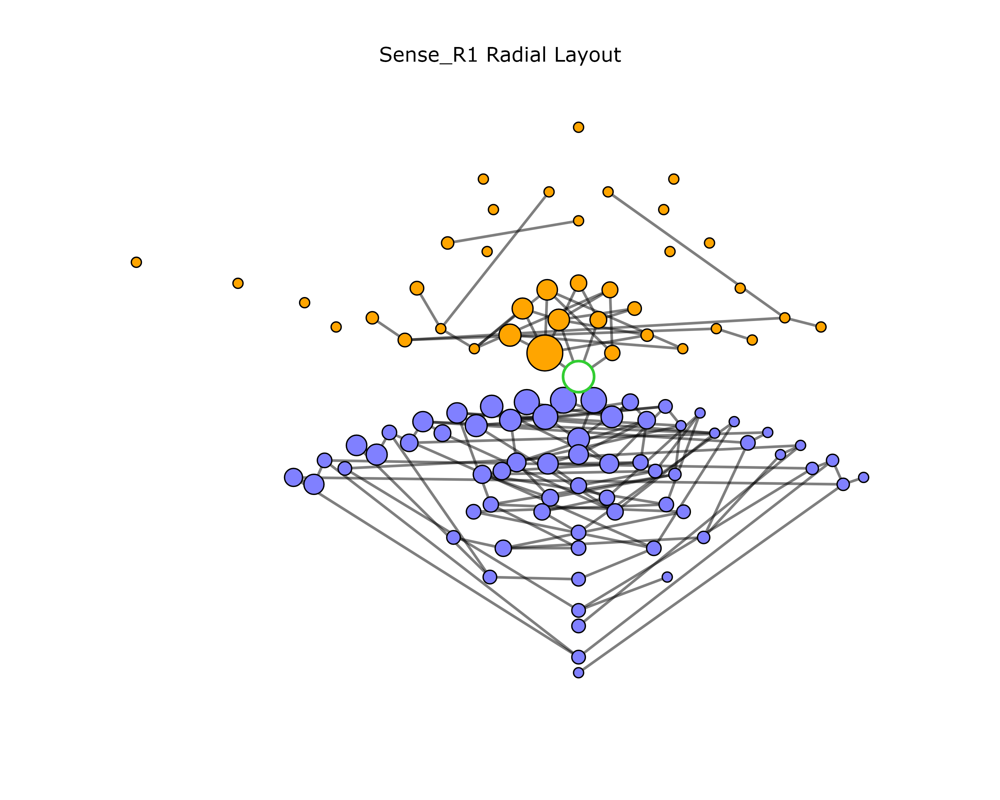

# DSBplot

## Introduction

`DSBplot` is a Python 3 program for processing and visualizing high-throughput targeted amplicon sequencing data obtained to study double-strand break (DSB) repair due to the nonhomologous end-joining (NHEJ) repair mechanism. The accompanying article describing this software is [Channagiri *et al.*](https://doi.org/10.48550/arXiv.2312.17590) This protocol was originally used in [Jeon *et al.*](https://doi.org/10.1101/2022.11.01.514688) for studying DSB repair in human cells. The Jeon *et al.* article contains several examples of the graphs in the supplementary figures, as well as a discussion of the insights gained from the resulting figures.

The overall functionality of the package is the following.

  1. Process DNA-seq short reads that have been obtained from amplicon sequencing data, where the amplified sequence surrounds the location of a synthetic DSB (e.g., via CRISPR/Cas9).
  2. Quantify the variations (insertions, deletions, and substitutions) near the DSB site using sequence alignment.
  3. Visualize the resulting variations using two types of figures: *variation-distance graphs* and *variation-position histograms*.

The expected inputs are DNA-seq short read libraries that have been obtained with targeted amplicon sequencing, meaning that sequencing primers are placed surround the DSB site to amplify a specific sequence around the DSB repair site. For a more detailed description of the expected input and how to the run the software, see section [Commands](#commands) and the accompanying article [here](https://doi.org/10.48550/arXiv.2312.17590).

## Citation

If you use this software, please use the citation:

Tejasvi Channagiri, Margherita Maria Ferrari, Youngkyu Jeon, Penghao Xu, Francesca Storici, and Nataša Jonoska. “DSBplot: Indels in DNA Double-Strand Break Repair Experiments.” arXiv, December 29, 2023. https://doi.org/10.48550/arXiv.2312.17590.

## Installation

To install the package, use the command:

```
pip install DSBplot
```

The tested Python version is 3.11.0. The dependencies are:

* kaleido: Tested version 0.1.0.post1. If using Windows OS the version *must* be 0.1.0.post1; please see [here](https://github.com/plotly/Kaleido/issues/134). This dependency is *optional* and is only needed if you want to write variation-distance graphs to non-HTML image formats (e.g., PNG or SVG). If you do not need this functionality, you may omit this dependency.
* Levenshtein: Tested version 0.21.0. Required.
* matplotlib. Tested version 3.7.1. Required.
* networkx. Tested version 3.1. Required.
* numpy. Tested version 1.24.3. Required.
* pandas. Tested version 2.0.1. Required.
* Pillow. Tested version 10.1.0. Required.
* plotly. Tested version 5.14.1. Required.
* scikit-learn. Tested version 1.2.2. Required.

To install the required dependencies, please use the command:

```
pip install Levenshtein matplotlib networkx numpy pandas Pillow plotly scikit-learn
```

To install the optional kaleido dependency, please use one of the commands (depending on your OS):

```
pip install kaleido=0.1.0.post1 # Windows
pip install kaleido # other than Windows
```

For a full list of the libaries used in testing, please see `requirements.txt`.

Bowtie 2 (tested version 2.5.0) should be installed and available on the system path. The executables `bowtie2-build-s` and `bowtie2-align-s` should be available as commands (internally, we use the Python function `os.system()` to run Bowtie 2).

## Commands

This package contains the following four commands:

* `DSBplot-process`: Takes as input either (1) FASTQ files of trimmed and quality-filtered reads or (2) SAM files of reads aligned to the reference sequence, and a FASTA file containing the reference sequence. Creates the intermediate tables needed for plotting the graphs and histograms. Multiple input files may be specified to represent replicate experiments (e.g., biological replicates).
* `DSBplot-graph`: Takes as input a collection of the output directories of `DSBplot-process`, lays out sequences in all inputs, and plots a separate graph for each input.
* `DSBplot-histogram`: Takes as input an output directory of `DSBplot-process` and plots a histogram showing the type and position of variations (insertions, deletion, or substitutions) in the sequences.

Once DSBplot is installed, these commands should be available from the command line. More information about each command is given in the following subsections. The flowchart below show the relationship between the different commands. In the following sections, we use the notation `NAME` to refer to arguments (value of a command-line parameter set by the user) and the notation `--name` to refer to the parameter itself. The notation `file_name.ext` is used to refer to file names.


### `DSBplot-process`

The `DSBplot-process` command perform alignment and processing of the preprocessed FASTQ data.

#### Input

There are two file types that may be specified for the main input: FASTQ files or SAM files. Either all the input files must be FASTQ or all must be SAM.
If using FASTQ, we expect that they have already been trimmed and quality filtered by the user. No further trimming and quality filtering is done by this pipeline. If using SAM files, we expect that they have been already aligned to the reference sequence. For both FASTQ and SAM input, the reference sequence must also be provided (and must be identical to the sequence used to align all SAM files used as input). The region of DNA represented in the reads (with both FASTQ or SAM input) must exactly match the region of DNA represented by the input reference sequence (aka amplicon sequence). This mean that if a given read represents a perfectly repaired DNA molecule, it should be identical to a prefix of the reference sequence (assuming no sequencing substitution errors). The read may be strictly smaller (i.e., a strict prefix) of the reference due to read length limitations. If multiple input FASTQ or SAM files are given, it is assumed that they are replicates of the same treatment condition. They are all processed identically and then combined into a single file (see [Processing stages](#prepcocessing-stages) below).

#### Alignment substitutions

The processing pipeline produces two different versions of most files: one *without* substitutions (suffix "withoutSubst") and another *with* substitutions (suffix "withSubst"). The processing for files that ignore substitutions contains an extra step that replaces alignment substitutions (aka mismatches) with perfect matches with the reference sequence. Substitutions were ignored in our previous analyses because we noticed a similar distribution of substitutions occurring in both the postive treatment group (where DNA double-strand breaks were induced) and the control group (where no DSBs were induced). This suggested that the majority of substitutions were likely caused by DNA damage during library preparation or sequencing errors, rather than representing variations due to the DNA repair process. In the command `DSBplot-graph`, the `--sub` parameter controls whether to use the output with or without substitutions. The `DSBplot-histogram` command only uses the output with substitutions, since it is used to examine the distribution of substitutions.

#### Processing stages

This `DSBplot-process` command is broken in separate stages so that each stage can be run separately. However, the stages must be run in the correct order indicated by their numeric prefixes. When running the stages separately, the value of the `OUTPUT` directory must the same value on each separate invocation. Two different experiments should not be given the same `OUTPUT` directory or the data from the second will overwrite the first. The following describes each stage in more detail.

* **0_align**: Align FASTQ reads against FASTA reference sequence (only done with the input is FASTQ files). This stage requires one or more input FASTQ files representing independent replicates of the same treatment condition. The base file names of the libraries, after removing the file extension, must all be distinct and be given in alphabetical order. The alignment is done independently for each of the input FASTQs. The output of this step is a set of [SAM](https://samtools.github.io/hts-specs/SAMv1.pdf) files, one for each input FASTQ. Please ensure that [Bowtie 2](https://bowtie-bio.sourceforge.net/bowtie2/index.shtml) (version ≥ 2.5 tested) is installed and that the commands `bowtie2-build-s` and `bowtie2-align-s` are available on the system path for use by the Python function `os.system()`. The output files from this stage are:

    * `bowtie2/*`: The Bowtie 2 index files built with `bowtie2-build-s`.
    * `<lib>.sam`: The SAM file output from the alignment by `bowtie2-align-s`, where `<lib>` is a placeholder for the base file name of the FASTQ library without the extension. There will be one SAM files for each input library.

* **1_filter**: Filter each SAM file independently using heuristics to discard alignments that may not represent NHEJ repair (this is the first stage if the input is SAM files). The filtering process involves the following steps:

    1. Discard alignments that have an invalid SAM FLAG field. The only allowed FLAG values are 0 (for a successful forward alignment) or 16 (for a successful reverse-complement alignment, if `--rc 1` is used).
    2. Discard alignments where the read sequence has length less than `MIN_LENGTH`.
    3. Discard alignments where the left-most (5'-most) position of the read does not align with the left-most position of the reference sequence (that is the SAM POS field must be 1).
    4. If the indel positions of the alignment are not touching the DSB position or not consecutive, try to shift them towards the DSB position in a way that does not increase the number of substitutions (mismatches). If such a modification of the alignment cannot be found, discard the alignment. These criteria may be modified with `--touch`, `--consec`, and `--realign`.
    5. Discard alignments that have more than `MAX_SUBST` substitutions. A large number of substitutions may indicate that the alignment is not valid. By default there is no limit, since the threshold will depend on the user's needs.

  If multiple reads have exactly the same nucleotide sequence but had different alignments with the reference, they will be forced to have the same alignment as the first such read encountered. The left-most (5'-most) position on the read must align with the left-most position on the reference, but the same is not true for the right-most (3'-most) positions. This is because it is possible for reads to be too small and only capture the 5' end of the reference but not the 3' end. However, the read must have a length of at least `DSB_POS + 1` and `MIN_LENGTH`. The output will be in the following files.

    * `filter_accepted.csv`: Sequences that passed the filter (`seq` column). Additional columns are `debug` (reason for accepting), `sub` (number of substitutions), `cigar` (realigned CIGAR string), `cigar_old` (original CIGAR string), `freq_mean` (mean frequency of sequence over all replicates), `freq_<lib>` (separate frequency column for each replicate library, `<lib>`), `count_<lib>` (separate count column for each replicate library, `<lib>`), `rank_<lib>` (separate rank column for each replicate library, `<lib>`, from 1 (most frequent) to least frequent; 999999999 indicates that the sequence was not present in the library).
    * `filter_rejected.csv`: Sequences that failed the filter (`seq` column). Additional columns are `debug` (reason for rejecting), `cigar_old` (original CIGAR string), `unaligned` (was the read unaligned in the SAM file; SAM FLAG 4), `freq_mean` (mean frequency of sequence over all replicates), `freq_<lib>` (separate frequency column for each replicate library, `<lib>`), `count_<lib>` (separate count column for each replicate library, `<lib>`), `rank_<lib>` (separate rank column for each replicate library, `<lib>`, rank 1 is most frequent; 999999999 indicates that the sequence was not present in the library).
    * `filter_debug.csv`: Summary table showing the number of reads accepted/rejected and for what reason, in each replicate library.
    * `filter_args.json`: JSON file showing the arguments passed to the `filter.py` script.

* **2_window**: For each unique alignment in the output table of stage **1_filter**, obtain the portion of the read, callend the *repair window*, that aligns to the positions `DSB_POS - WINDOW_SIZE + 1` to `DSB_POS + WINDOW_SIZE` on the reference sequence. If different reads become identical after obtaining their repair windows, their read counts will be summed. To ensure that variations near the DSB do not spill outside the window, *anchor sequences* must be present on either side of the extracted windows. Anchor sequences are the parts of the read that align to the `ANCHOR_SIZE` nucleotides on the left (5') and right (3') of the window on the reference. These are the nucleotides `DSB_POS - WINDOW_SIZE - ANCHOR_SIZE + 1` to `DSB_POS - WINDOW_SIZE` (left anchor sequence) and `DSB_POS + WINDOW_SIZE + 1` to `DSB_POS + WINDOW_SIZE + ANCHOR_SIZE` (right anchor sequence) on the reference sequence. Each anchor must have at most `ANCHOR_SUBST` mismatches and `ANCHOR_INDEL` indels, or it is discarded. The anchor sequence check may be omitted by setting `ANCHOR_SIZE` = 0. The output are the following tables in TSV format.

    * `window_withoutSubst.tsv`: Repair window TSV file with the substitutions removed. 
    * `window_withSubst.tsv`: Repair window TSV file with substitutions retained.
    * `window_withoutSubst_args.json`: JSON file showing the arguments passed to the `get_window.py` script for the output without substitutions.
    * `window_withSubst_args.json`: JSON file showing the arguments passed to the `get_window.py` script for the output with substitutions.
   
  Each row in the TSV files corresponds to a single repair window. The columns in the TSV files will be `ref_align` (the alignment string corresponding to the reference sequence), `read_align` (the alignment string corresponding to the read sequence), `freq_mean` (mean frequency of sequence over all replicates), `freq_<lib>` (separate frequency column for each replicate library, `<lib>`), `count_<lib>` (separate count column for each replicate library, `<lib>`).

* **3_variation**: Separate each repair window from the previous stage into its constituent variations. For example, the repair window alignment `AC-CGT` (reference), `-CGCTT` (read) would be split into 3 variations: deletion at position 1 (`A` ⇒ `-`), insertion at position 2 (`-` ⇒ `G`), and substitution at position 3 (`G` ⇒ `T`). The keys identifying each unique variation are: the total number of variations on the parent alignment, the position of the variation, and the type of variation. In the previous example this would be: (3, 1, 'del'), (3, 2, 'ins'), and (3, 3, 'sub'). The output will be located in the following files.

    * `variation_withoutSubst.tsv`: Variation TSV table made from windows without substitutions.
    * `variation_withSubst.tsv`: Variation TSV table made from windows with substitutions.
    * `variation_withoutSubst_args.json`: JSON file showing the arguments passed to the `get_variation.py` script for the output without substitutions.
    * `variation_withSubst_args.json`: JSON file showing the arguments passed to the `get_variation.py` script for the output with substitutions.
  
  The columns in these files are `freq_mean` (mean frequency of variation over all replicates), `freq_<lib>` (separate frequency column for each replicate library, `<lib>`), `count_<lib>` (separate count column for each replicate library, `<lib>`), `num_var` (number of variations on the parent alignment), `var_pos` (position of the variation on the reference sequence), `var_type` (type of variation: 'ins', 'del', or 'sub'), `var_letter` (two letter string showing the corresponding nucleotide or '-' on the reference and read alignment string, respectively). Each row in the TSV files corresponds to a single unique variation (i.e., a unique combination of `var_pos`, `num_var`, and `var_type`, after splitting all the repair windows into their variations). The frequencies and counts are computed by summing the frequencies and counts of all repair windows that have variation indicated by the `var_pos`, `num_var`, and `var_type` values of the row.

* **4_info**: Write metadata describing the arugments used to form the library for later use. The output is writted to the `data_info.json` file. The following fields are included in the file:

  * `format`: Always "individual" (this is used internally).
  * `ref_seq_window`: Reference sequence after restricting to the window around the DSB site.
  * `name`: Name of the experiment obtained from the output directory base name.
  * `label`: User-specified label for the experiment to be used in the figure labels.
  * `ref_seq`: Full reference sequence used for the experiment.

For more information about the parameters, please use the command `DSBplot-process --help`.

### `DSBplot-graph`

This command performs the vertex lay out and final plotting of the variation-distance graphs. Multiple inputs may be specified to lay out the vertices jointly, as long as their windowed reference sequences are identical. See the [Graphs](#graphs) section for a description of the meaning of different visual properties of the graph (e.g., edges, vertex sizes, colors, etc.). Two types of graph may be plotted: *individual* graphs and *comparison* graphs. The individual graphs represent the sequence frequencies of a single experiment, while the comparison graphs compare the sequence frequencies for two different experiments. For more details about the parameters and how to plot these graphs, please use the command `DSBplot-graph --help` and consult the demo scripts located in the `demo_short` and `demo_long` directory (see [Demonstration](#demonstration) also).

### `DSBplot-histogram`

This commands plots the 3D histograms, which summarize the distribution of the variations in the windows around the DSB site. Each histogram shows a single type of variation (insertion, deletion, or substitution), which is determined by the `--var_type` parameter. The axes are described in the following.

* The position of each variation is shown on the $x$-axis of the graphs. The position can be represented in two ways: relative to the position of the DSB, or relative to the 5'-end of the window. The method used is determined by the `--xax` parameter. For deletions and substitutions, the position of the variation is unambiguous and corresponds to a specific position on the reference sequence. However, for insertions, the position is assigned to the left (5') position of the two consecutive positions flanking the insertion.
* The $y$-axis indicates the total number of variations on the sequence that the variation originated from.
* The $z$-axis indicates the total frequency of the variations with the given $x$- and $y$-coordinates. This is computed by summing the frequency of all the parent repair windows of such variations.

To understand how the frequencies are calculated, consider the following example. Suppose a sequence in the data had one insertion at position 5, two deletions at positions 6 and 7, and an overall frequency of 0.1. Assume that the DSB is between positions 5 and 6, and that we are using relative labeling on the $x$-axis. In the insertion histogram, the sequence would contribute +0.1 to the z-value of the bar at the $xy$-coordinate (-1, 3). In the deletion histogram, the sequence would contribute +0.1 to the z-value of the bars at the $xy$-coordinates (1, 3) and (2, 3). If we used absolute labeling, then the respective $xy$-coordinates would be (5, 3), (6, 3), and (7, 3), since the positions are now labeled according to their absolute positions on the reference sequence.

For more details about the parameters, please use the command `DSBplot-histogram --help`.

## Graphs

In this section, we will explain the visual elements of the output graphs generated by the `DSBplot-graph` command. We use the terms "sequence" and "vertex" interchangeably, as there is a one-to-one correspondence between the repair window sequences produced by the [`DSBplot-process`](#dsbplot-process) command and the vertices of the graph.

### Layouts

Different *layouts*, specified with the `--layout` parameter, are used to position the vertices. We describe a subset of them in the following.

* Kamada-Kawaii: The Kamada-Kawaii algorithm is a physical simulation algorithm used for laying out graphs (Kamada and Kawai, 1989). In this algorithm, the graph is represented as a spring system where each pair of vertices is connected by a spring whose resting length is proportional to the shortest-path distance between the vertices. The algorithm works by finding the optimal positions of the vertices that minimize the energy of the system. The result is a layout that is both aesthetically pleasing and reveals the graph structure, such as clusters of vertices that are close together. The [NetworkX](#https://networkx.org/) Python package (Hagberg, 2008) implements this algorithm, and as of this writing, it initializes the vertices in a circle. The shortest-path distance between two vertices is at least as large as the Levenshtein distance between them, but it doesn't have to be equal.
* Universal layout: We refer to this layout as the "Universal" layout because it assigns a predefined position to every admissable insertion and deletion, regardless of the subset of insertions and deletions present in the dataset. In contrast to the Kamada-Kawai algorithm, which positions vertices in a data-dependent manner, this layout algorithm is less flexible but highly interpretable and reproducible. This layout also only applies to data *without* substitutions (specified with `--sub 0`), and does not allow sequences with mixed insertions/deletions (it currently fails if such sequences are encountered). All inputs should also have indels consecutive and touching the DSB site (in `DSBplot-process`, set with `--consec 1` and `--touch 1`, which are the defaults). Therefore, the admissable vertices always have either a single run of deletions touching the DSB site or a single run of insertions exactly at the DSB site. If these criteria are not met, the behavior is either undefined or an error message. The universal layout places the reference vertex at the center of the figure, with insertion vertices above and deletion vertices below. For both insertion and deletion vertices, the $y$-coordinate is determined by the Levenshtein distance between the vertex's sequence and the reference sequence, which is simply the number indels in the vertex's alignment. If a vertex's Levenshtein distance is $d$, then deletion vertices are placed $d * \alpha$ units below the reference, while insertion vertices are placed $d * \beta$ units above, where $\alpha, \beta$ are positive scaling factors determined by the parameters `--ul_y_scale_ins` and `--ul_y_scale_del`. The $x$-coordinates of vertices are determined using different rules for insertions and deletions. Insertion vertices are ordered from left to right by alphabetical order, while deletion vertices are ordered from left to right based on the positions of the deleted nucleotides with respect to the DSB site. Please see **Extended Data Figure 7** of [Jeon *et al.*]((https://doi.org/10.1101/2022.11.01.514688)) for further explanation of this layout. There are several parameters to adjust the visuals of the universal layout. Please see the parameters prefixed with `--ul_`. 
* Radial: This layout arranges the vertices in concentric circles around the reference sequence. The reference vertex is positioned at the center of the figure, while the insertion and deletion vertices are placed above and below the reference, respectively. The Levenshtein distance between a vertex and the reference determines its physical distance from the reference vertex. For instance, vertices with a Levenshtein distance of 1 are placed in the first concentric circle around the reference, and those with a Levenshtein distance of 2 are placed in the second circle, and so on. In each circle, insertion vertices are arranged in a clockwise direction based on their frequency, with the most frequent vertex at the top, while deletion vertices are arranged in a counterclockwise direction, also based on their frequency, with the most frequent vertex at the bottom. To ensure that the vertices do not overlap and edges are not collinear, heuristics are used to perturb the vertices slightly.

The `--debug` parameter of the `DSBplot-graph` command allows users to output tables that describe the vertices plotted, their coordinates, and the edge between the vertices. This may be used to debug the layout algorithms or to extract the vertex coordinates for use in other software.

### Graph aesthetics

In this section, we describe the visual features of the graphs. Not all parameters are described here; for a full description please use `DSBplot-graph --help`.
* Graph types:
  * Individual: This graph type is plotted for the `i`th input if `INPUT[i]` is a single directory. The color of each vertex represents the type of variations in the vertex's sequence (see the `--var_types` and `--var_type_colors` parameters). See below for more details.
  * Comparison: This graph type is plotted for the `i`th input if `INPUT[i]` is a pair of directories separated by `::`. The reference sequence windows of the two libraries must be identical. The color of each vertex represents the frequency ratio of the vertex between the two experiments being compared (see the parameters beginning with `--ratio`). The vertices represented are the union of the vertices in both experiments. The size of each vertex is determined by the larger of the two frequencies. See below for more details.
* Vertices:
  * Size: For an individual graph, the vertex radius is a function of the log-frequency. This is controlled by the parameters `--size_freq` and `--size`. Vertices with frequencies $\leq$ `NODE_SIZE_FREQ_MIN` gets `NODE_SIZE_PX_MIN` and frequencies $\geq$ `NODE_SIZE_FREQ_MAX` gets `NODE_SIZE_PX_MAX`. Frequencies in between get a radius that varies linearly with the log-frequency. The size of the vertices in a comparison graph is determined by the larger of the two frequencies, in the same way as an individual graph.
  * Outline: The outline color is intended to differentiate the reference sequence vertex from the other vertices. The colors are determined by the `--ref_outline_color` and `--outline_color` parameters.
  * Color: There are several ways the vertex color is determined:
    * Variation type: This mode is only for individual graphs. Vertices are assigned a color depending on the type of variations present in their alignment: insertions only, deletions only, substitutions only, mixed (which is a combinations of insertions, deletions, and substitution), and none (which represents the reference sequence). These colors can be defined by using the `--var_type_colors` parameter.
    * Frequency ratio (continuous): This mode is only for comparison graphs, and can be activated by setting the parameter `--ratio_color_type cont` (the default). In this mode, a color gradient is used for each vertex to indicate the frequency ratio of the vertex between the two experiments being compared. The ratio is calculated by dividing the vertex's frequency in the first sample by the vertex's frequency in the second sample. The colors at the two ends of the gradient are specified by the `--ratio_colors` parameter, while the colors in between are smoothly interpolated based on the log frequency ratio. The range of ratios at the two ends of the gradient is determined by the `--ratio_range` parameter.
    * Frequency ratio (discrete): This mode is only for comparison graphs, and can be activated by setting the parameter `--ratio_color_type disc`. In this mode, three colors are used to indicate the frequency ratio of the vertex between the two experiments being compared. If the frequency ratio is less than `NODE_FREQ_RATIO_MIN`, the color `NODE_FREQ_RATIO_COLOR_1` is displayed (meaning higher in sample 2). If the frequency ratio is greater than `NODE_FREQ_RATIO_MAX`, the color `NODE_FREQ_RATIO_COLOR_2` is displayed (meaning higher in sample 1). If the frequency ratio is between `NODE_FREQ_RATIO_MIN` and `NODE_FREQ_RATIO_MAX` (inclusive), the vertex is colored white.
* Edges: All edges in the graphs indicate a 1-nucleotide variation (insertion, deletion, or substitution) between the two vertices that are connected. The display of edges can be controlled by using the `--edge` and `--edge_types` parameters.
* Legends: The legends describe the vertex size, vertex outline, vertex color, and the edges. Any/all of these can be drawn by using the `--legends` parameter. The legends will be drawn in the right margin of the figure. To ensure enough room, use the `--mar_t`, `--mar_b`, `--mar_l`, and `--mar_r` parameters to size the margins. The different legends are laid out vertically. To control the spacing between them use the `--legend_spacing` parameter.
* Title: Titles can be optionally added to the top margin of each figure using the `--title` parameter (as many titles as inputs must be specified).
* Universal layout axes: To illustrate the vertex placement for the universal layout, axes can be drawn on the figure. Using the `--ul_xax_del_y_pos` parameter, a horizontal axis can be drawn on the deletion side (below the reference sequence), which, for each deletion vertex, shows the approximate position of the range of deleted nucleotides (see [Figure 1](#graphs)). Using the `--ul_xax_ins_y_pos` parameter, a horizontal axis can be drawn on the insertion side (above the reference sequence) to show the alphabetical order of the nucleotides. Using the `--ul_yax_x_pos` parameter, a vertical axis can be drawn to show the Levenshtein distance of vertices from the reference vertex. There are several other parameters to control various aspects of the axes: `--ul_xax_del_type`, `--ul_yax_y_range`, `--ul_xax_x_range`, `--ul_yax_del_max_tick`, and `--ul_yax_ins_max_tick`. The following are used to scale the axes by different amounts for aesthetics purposes: `--ul_x_scale_ins`, `--ul_y_scale_ins`, `--ul_x_scale_del`, and `--ul_y_scale_del`. To help positioning the axes, a message is printed to the console showing the range of $x$- and $y$-coordinates for each figure when `DSBplot-graph` is run.

## Demonstration

To begin this demonstration set the terminal working directory to the `demo_short` directory. The full sequence of commands described here are also included in the `run.ps1` (PowerShell) and `run.sh` (bash) scripts, which should run in less than a minute on a personal computer. Several example input files are available in the `input` directory:

* `data_demo/fastq/Sense_R1_1.fa`, `data_demo/fastq/Sense_R1_2.fa`, `data_demo/fastq/Sense_R1_3.fa`, `data_demo/fastq/Sense_R1_4.fa`: High-throughput sequencing reads in FASTQ format for four biological replicates of an experiment called "Sense_R1".
* `input/ref_seq/2DSB_Sense_R1.fa`: Reference sequence FASTA file for the Sense_R1 reads.
* `data_demo/sam/Sense_R1_1.sam`, `data_demo/sam/Sense_R1_2.sam`, `data_demo/sam/Sense_R1_3.sam`, `data_demo/sam/Sense_R1_4.sam`: The four FASTQ files above aligned to the reference sequence above using Bowtie 2.

The FASTQ files have already been trimmed so that they should align correctly to the reference sequence. If you compare the reads in the FASTQ files with the reference sequence FASTA, you will observe that the beginning of each read is very similar to the beginning of the reference sequence (although most reads are not long enough to reach to the end of the reference). This is demonstration data that has been generated by taking a small subset of an actual dataset from the study [Jeon *et al.*]((https://doi.org/10.1101/2022.11.01.514688)).

The output data will be written to the `output/Sense_R1` directory. First, set up the directory names by running:

```
# Powershell
$input_fq_dir = "input/fastq"
$input_sam_dir = "input/sam"
$ref_seq_dir = "input/ref_seq"
$output_dir = "output"
$debug_dir = "debug"
```

We show three different ways of running the pipeline.

* To run all processing stages use the command:
  
  ```
  # Powershell
  DSBplot-process -i $input_fq_dir/Sense_R1_1.fq $input_fq_dir/Sense_R1_2.fq $input_fq_dir/Sense_R1_3.fq $input_fq_dir/Sense_R1_4.fq --ref $ref_seq_dir/2DSB_Sense_R1.fa --dsb 67 -o $output_dir/Sense_R1 --label "Sense_R1" --reads 3000 3000 3000 3000
  ```

* To run the processing stages separately, use the commands:
  
  ```
  # Powershell
  DSBplot-process -i "$input_fq_dir/Sense_R1_1.fq" "$input_fq_dir/Sense_R1_2.fq" "$input_fq_dir/Sense_R1_3.fq" "$input_fq_dir/Sense_R1_4.fq" --ref "$ref_seq_dir/2DSB_Sense_R1.fa" -o "$output_dir/Sense_R1" --stages 0
  DSBplot-process --ref "$ref_seq_dir/2DSB_Sense_R1.fa" --dsb 67 -o "$output_dir/Sense_R1" --reads 3000 3000 3000 3000 --stages 1_filter
  DSBplot-process -o "$output_dir/Sense_R1" --stages 2_window
  DSBplot-process -o "$output_dir/Sense_R1" --stages 3_variation
  DSBplot-process -o "$output_dir/Sense_R1" --stages 4_info
  ```

* To run the processing stages with pre-aligned SAM files, use the commands:
  
  ```
  # Powershell
  DSBplot-process -i "$input_sam_dir/Sense_R1_1.sam" "$input_sam_dir/Sense_R1_2.sam" "$input_sam_dir/Sense_R1_3.sam" "$input_sam_dir/Sense_R1_4.sam" --ref "$ref_seq_dir/2DSB_Sense_R1.fa" --dsb 67 -o "$output_dir/Sense_R1" --label "Sense_R1" --reads 3000 3000 3000 3000
  ```

The commands indicates that the DSB site is between the 67th and 68th nucleotide on the reference sequence (`--dsb 67`), and each FASTQ file has 3000 reads (`--reads 3000 3000 3000 3000`). The data written to `output/Sense_R1` should be exactly the same whether the stages are run together, separately, or with SAM files (the input SAM files have been aligned using Bowtie 2 in the same way the pipeline normally does with input FASTQ files). The raw data used for plotting the variation-distance graphs will be contained in `output/Sense_R1/window_withoutSubst.tsv` and `output/Sense_R1/variation_withSubst.tsv`. The data for the variation-position histograms will be contained in `output/Sense_R1/variation_withoutSubst.tsv` and `output/Sense_R1/variation_withSubst.tsv`.

Next, the plotting commands will write the output figures to the `plots` directory. To plot a variation-distance graph using the Universal layout with axes use the command (PNG generation for graphs will only work if the kaleido package is installed, see [Installation](#installation)):

```
# PowerShell
DSBplot-graph -i $output_dir/Sense_R1 -o plots/graph/Sense_R1_universal.png --debug $debug_dir/universal --layout universal --title "Sense_R1 Universal Layout" --width 2400 --height 1800 --ul_yax_x 0 --ul_xax_del_y 0 --ul_xax_ins_y 0
```

A single input is given and a single output is plotted. Debug files (`--debug $debug_dir/universal`) are written that show the vertices plotted, their coordinates, and the edges between vertices. The positions of the axes are set to 0 (`--ul_yax_x 0 --ul_xax_del_y 0 --ul_xax_ins_y 0`) to indicate they should be automatically chosen. To position the axes manually or zoom in on certain parts of the graph (i.e., parameters `--range_x` and `--range_y`), please see the console output after running this command, which shows the $x$ and $y$ ranges of the plotted vertices. In this case, the console should read:

```
Figure[0] x-range: -10.0 to 10.0
Figure[0] y-range: -17.0 to 41.8125
```

The Kamada-Kawaii and Radial layouts may similarily be plotted using the commands (PNG generation for graphs will only work if the kaleido package is installed, see [Installation](#installation)):

```
# PowerShell
DSBplot-graph -i $output_dir/Sense_R1 -o plots/graph/Sense_R1_kamada.png --debug $debug_dir/kamada --layout kamada --title "Sense_R1 Kamada-Kawaii Layout" --width 2400 --height 1800 --sep 1
DSBplot-graph -i $output_dir/Sense_R1 -o plots/graph/Sense_R1_radial.png --debug $debug_dir/radial --layout radial --title "Sense_R1 Radial Layout" --width 2400 --height 1800
```

The `--sep 1` setting in the Kamada-Kawaii layout plot is used indicate that the connected components of the graph should be separated to avoid vertices overlapping.

The outputs for each of the three layouts are shown below.




To create interactive HTMLs of the previously plotted figures, use the commands:

```
# PowerShell
DSBplot-graph -i $output_dir/Sense_R1 -o plots/graph/Sense_R1_universal.html --layout universal --title "Sense_R1 Universal Layout" --width 2400 --height 1800 --ul_yax_x 0 --ul_xax_del_y 0 --ul_xax_ins_y 0
DSBplot-graph -i $output_dir/Sense_R1 -o plots/graph/Sense_R1_kamada.html --layout kamada --title "Sense_R1 Kamada-Kawaii Layout" --width 2400 --height 1800 --sep 1
DSBplot-graph -i $output_dir/Sense_R1 -o plots/graph/Sense_R1_radial.html --layout radial --title "Sense_R1 Radial Layout" --width 2400 --height 1800
```

The only difference is the `.html` file extension for the output. These outputs can be opened in a browser and vertices may be inspected in more detail by hovering over them with the cursor.

Finally, to plot the variation-position histograms, use the commands:

```
DSBplot-histogram -i $output_dir/Sense_R1 -o plots/histogram/Sense_R1_sub.png --title "Sense_R1 Substitutions" --color "#bfbfbf" --mar_t 200 --var sub --xax rel
DSBplot-histogram -i $output_dir/Sense_R1 -o plots/histogram/Sense_R1_ins.png --title "Sense_R1 Insertions" --color "#ffa500" --mar_t 200 --var ins --xax rel
DSBplot-histogram -i $output_dir/Sense_R1 -o plots/histogram/Sense_R1_del.png --title "Sense_R1 Deletions" --color "#8080ff" --mar_t 200 --var del --xax rel
```

The `--var` parameter determines which type of variation is plotted ("ins" for insertions, "del" for deletions, and "sub" for substitutions). The `--mar_t` parameter is used to set the top margin to make room for the title. The title is set with the `--title` parameter.

The output variation histograms are shown below.


For more information about the commands or their parameters, use the commands:

```
DSBplot-process --help
DSBplot-graph --help
DSBplot-histogram --help
```

Although not covered here, comparison graphs may be produced by specifying two input directories, separated by `::` (there should be only these characters and no extra spaces). Please see the more detailed demo script in the `demo_long` directory for examples of making comparison graphs and other features of the commands.

## Contact

For questions about this software please contact the maintainer Tejasvi Channagiri at [tchannagiri@gmail.com](mailto://tchannagiri@gmail.com).

## Contributors

* Tejasvi Channagiri (https://github.com/tchannagiri)
* Margherita Ferrari (https://github.com/mmferrari)
* Youngkyu Jeon 
* Penghao Xu (https://github.com/xph9876)